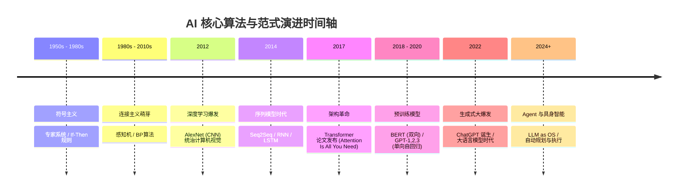

> 万物皆数，从规则的牢笼走向概率的自由。

在直接上手写 Agent 代码之前，我们必须先花点时间把底层的 AI 原理、算法逻辑和演进脉络彻底吃透。只有知其然更知其所以然，才能在后续的工程实践中游刃有余，避免成为只会调 API 的“API Caller”。

本篇是<strong>《AI 技术演进与核心算法实战：从原理到 Agent》全景系列</strong>的第一篇，隶属于<strong>【第一模块：基石篇 —— 数学直觉与模型原理】</strong>。我们将一起溯源 AI 的发展简史，理清技术演进脉络，理解 AI 到底是如何从刻板的规则走向智能的“思考”的。

## 1. 符号主义时代：基于规则的专家系统

早期的人工智能探索主要集中在**符号主义（Symbolism）**。这一流派认为，人类的认知可以被还原为对符号的逻辑运算。如果能把人类的知识抽象为一条条“规则”，机器就能像专家一样解决问题。

这就是<strong>专家系统（Expert Systems）</strong>的由来。它的核心逻辑非常简单粗暴：基于布尔逻辑的 `If-Then`（如果-那么）。

<div align="center">
  <svg xmlns="http://www.w3.org/2000/svg" viewBox="0 0 600 280" width="100%" height="100%" style="max-width: 600px; margin: 20px 0;">
    <defs>
      <style>
        .box { fill: #f8fafc; stroke: #3b82f6; stroke-width: 2; rx: 8; ry: 8; }
        .text { font-family: -apple-system, BlinkMacSystemFont, "Segoe UI", Roboto, sans-serif; font-size: 16px; fill: #1e293b; text-anchor: middle; dominant-baseline: middle; }
        .title { font-weight: bold; font-size: 18px; fill: #0f172a; }
        .line { stroke: #64748b; stroke-width: 2; marker-end: url(#arrow); fill: none; }
        .dashed-line { stroke: #64748b; stroke-width: 2; stroke-dasharray: 6,6; marker-end: url(#arrow); fill: none; }
        .bg { fill: transparent; }
      </style>
      <marker id="arrow" viewBox="0 0 10 10" refX="9" refY="5" markerWidth="6" markerHeight="6" orient="auto">
        <path d="M 0 0 L 10 5 L 0 10 z" fill="#64748b" />
      </marker>
    </defs>
    <rect width="100%" height="100%" class="bg" />
    <rect x="200" y="20" width="200" height="80" class="box" />
    <text x="300" y="50" class="text title">知识库 (Knowledge Base)</text>
    <text x="300" y="75" class="text" font-size="14">If-Then 规则与领域事实</text>
    <rect x="200" y="160" width="200" height="80" class="box" />
    <text x="300" y="190" class="text title">推理机 (Inference Engine)</text>
    <text x="300" y="215" class="text font-size="14">逻辑匹配、演绎推理</text>
    <rect x="30" y="175" width="100" height="50" class="box" fill="#e0f2fe" />
    <text x="80" y="200" class="text">输入 (症状)</text>
    <rect x="470" y="175" width="100" height="50" class="box" fill="#dcfce3" />
    <text x="520" y="200" class="text">输出 (诊断)</text>
    <line x1="130" y1="200" x2="190" y2="200" class="line" />
    <line x1="400" y1="200" x2="460" y2="200" class="line" />
    <path d="M 270" y1="150" x2="270" y2="110" class="dashed-line" />
    <path d="M 330" y1="110" x2="330" y2="150" class="dashed-line" />
    <text x="235" y="130" class="text" font-size="12" fill="#64748b">查询规则</text>
    <text x="375" y="130" class="text" font-size="12" fill="#64748b">返回匹配</text>
  </svg>
</div>

专家系统通常由两部分组成：**知识库（存满人类总结的规则）** 和 **推理机（负责执行规则匹配）**。

```python
# 一个极简的“医疗诊断”专家系统（伪代码演示）
def diagnose(symptoms):
    if "发热" in symptoms and "咳嗽" in symptoms:
        if "呼吸困难" in symptoms:
            return "疑似肺炎，请立即就医！"
        else:
            return "可能是普通感冒或流感。"
    elif "头痛" in symptoms:
        return "可能是偏头痛或疲劳导致。"
    else:
        return "症状不明确，建议咨询真实医生。"
```

### 为什么符号主义最终走向了没落？

尽管专家系统在特定领域（如早期的医疗诊断 MYCIN、化学分析 DENDRAL）取得了一些成功，但它遇到了一个无法逾越的瓶颈：**现实世界的模糊性与组合爆炸**。

- **组合爆炸**：如果一个系统只有 10 个布尔变量，那就有 2<sup>10</sup>=1024 种组合；如果是 100 个变量呢？人类根本无法穷举和手动编写所有的 `If-Then` 规则。
- **特征难以提取（莫拉维克悖论）**：如何用语言描述一张猫的照片？“如果有两只尖耳朵、四条腿、有尾巴……”那如果是一只折耳猫呢？如果猫被遮挡了呢？高层逻辑推理对人类很难，但对机器很容易；而视觉感知对人类很容易，对机器却极难用规则定义。
- **缺乏泛化能力**：遇到规则库中没有的情况，系统会直接崩溃，无法举一反三。

符号主义的失败，让人们意识到：智能不能被简单地“编程”出来，必须让机器学会自己从数据中“学习”。

## 2. 连接主义崛起：神经网络与深度学习

当符号主义陷入低谷时，<strong>连接主义（Connectionism）</strong>迎来了春天。连接主义不再试图教机器具体的规则，而是模仿人类大脑的神经元结构，让机器通过大量数据自己寻找规律。

这就是<strong>人工神经网络（Artificial Neural Networks, ANN）</strong>的起点。

### 从感知机（Perceptron）到深度学习

感知机是最基础的神经网络单元。它的逻辑非常直观：接收多个输入（$x_i$），分别乘以代表重要性的权重（$w_i$），加上一个阈值偏置（$b$），最后通过一个激活函数（Activation Function）决定是否“激活”。数学公式表达为：

$$
y=\sigma\left(\sum_{i=1}^{n} w_i x_i + b\right)
$$

<div align="center">
  <svg xmlns="http://www.w3.org/2000/svg" viewBox="0 0 600 320" width="100%" height="100%" style="max-width: 600px; margin: 20px 0;">
    <defs>
      <style>
        .node { fill: #f8fafc; stroke: #3b82f6; stroke-width: 2; }
        .input-node { fill: #dbeafe; stroke: #2563eb; stroke-width: 2; }
        .hidden-node { fill: #fef08a; stroke: #ca8a04; stroke-width: 2; }
        .output-node { fill: #bbf7d0; stroke: #16a34a; stroke-width: 2; }
        .edge { stroke: #cbd5e1; stroke-width: 1.5; fill: none; }
        .text { font-family: -apple-system, BlinkMacSystemFont, "Segoe UI", Roboto, sans-serif; font-size: 14px; fill: #1e293b; text-anchor: middle; dominant-baseline: middle; }
        .bg { fill: transparent; }
      </style>
    </defs>
    <rect width="100%" height="100%" class="bg" />
    <text x="100" y="30" class="text" font-weight="bold">输入层 (Input)</text>
    <text x="300" y="30" class="text" font-weight="bold">隐藏层 (Hidden Layers)</text>
    <text x="500" y="30" class="text" font-weight="bold">输出层 (Output)</text>
    <g class="edge">
      <line x1="100" y1="90" x2="250" y2="70" /><line x1="100" y1="90" x2="250" y2="150" /><line x1="100" y1="90" x2="250" y2="230" />
      <line x1="100" y1="170" x2="250" y2="70" /><line x1="100" y1="170" x2="250" y2="150" /><line x1="100" y1="170" x2="250" y2="230" />
      <line x1="100" y1="250" x2="250" y2="70" /><line x1="100" y1="250" x2="250" y2="150" /><line x1="100" y1="250" x2="250" y2="230" />
      <line x1="250" y1="70" x2="350" y2="90" /><line x1="250" y1="70" x2="350" y2="170" /><line x1="250" y1="70" x2="350" y2="250" />
      <line x1="250" y1="150" x2="350" y2="90" /><line x1="250" y1="150" x2="350" y2="170" /><line x1="250" y1="150" x2="350" y2="250" />
      <line x1="250" y1="230" x2="350" y2="90" /><line x1="250" y1="230" x2="350" y2="170" /><line x1="250" y1="230" x2="350" y2="250" />
      <line x1="350" y1="90" x2="500" y2="130" /><line x1="350" y1="90" x2="500" y2="210" />
      <line x1="350" y1="170" x2="500" y2="130" /><line x1="350" y1="170" x2="500" y2="210" />
      <line x1="350" y1="250" x2="500" y2="130" /><line x1="350" y1="250" x2="500" y2="210" />
    </g>
    <circle cx="100" cy="90" r="20" class="input-node" /><text x="100" y="90" class="text">x1</text>
    <circle cx="100" cy="170" r="20" class="input-node" /><text x="100" y="170" class="text">x2</text>
    <circle cx="100" cy="250" r="20" class="input-node" /><text x="100" y="250" class="text">x3</text>
    <circle cx="250" cy="70" r="20" class="hidden-node" />
    <circle cx="250" cy="150" r="20" class="hidden-node" />
    <circle cx="250" cy="230" r="20" class="hidden-node" />
    <circle cx="350" cy="90" r="20" class="hidden-node" />
    <circle cx="350" cy="170" r="20" class="hidden-node" />
    <circle cx="350" cy="250" r="20" class="hidden-node" />
    <circle cx="500" cy="130" r="20" class="output-node" /><text x="500" y="130" class="text">y1</text>
    <circle cx="500" cy="210" r="20" class="output-node" /><text x="500" y="210" class="text">y2</text>
    <text x="300" y="300" class="text" font-size="12" fill="#64748b">反向传播 (BP) 算法通过梯度下降不断调整神经元之间的连接权重</text>
  </svg>
</div>

随着算力的提升和数据的爆发，单层感知机进化成了拥有多个隐藏层的<strong>深度神经网络（Deep Learning）</strong>。此时，<strong>反向传播算法（Backpropagation, BP）</strong>成为了网络学习的灵魂。机器就像一个蒙着眼睛下山的人，通过计算误差梯度，不断调整网络中数以亿计的权重，直到走到误差最小的“谷底”。

在这一时期，两大明星算法脱颖而出，彻底解决了感知问题：

1. **CNN（卷积神经网络）**：解决了图像识别问题。它通过“局部感受野”和“权值共享”，就像人类拿着放大镜看画一样，逐层提取图像的边缘、纹理，最后组合成高级的物体特征（如猫的耳朵）。
2. **RNN（循环神经网络）与 LSTM**：解决了序列问题（如语音、文本）。它通过隐藏状态（Hidden State）将上一个时刻的信息传递到当前时刻，使网络拥有了类似人类的“记忆”。

连接主义的本质是**概率与拟合**。我们不再告诉机器什么是猫，而是给它看一百万张猫的照片，让它通过反向传播算法不断调整权重，最终拟合出一个能够以极高概率认出猫的**高维数学空间特征边界**。

## 3. 生成式革命：Transformer 架构的诞生

深度学习虽然强大，但 RNN 在处理长文本时存在致命的缺陷：
1. **遗忘问题**：无论句子多长，RNN 都必须把它压缩成一个固定长度的向量，这就导致“读到句尾，忘了句首”。
2. **无法并行**：RNN 必须按顺序一个词一个词地处理，算力再强也无法同时计算，导致训练效率极低。

直到 2017 年，Google 提出了一篇名为《Attention Is All You Need》的划时代论文，**Transformer** 架构横空出世，开启了 AI 的第三次范式转移。

### 为何“注意力机制”让机器理解了语言？

Transformer 抛弃了 RNN 的顺序处理机制，引入了**自注意力机制（Self-Attention）**。

自注意力机制的直觉非常简单：**当我们理解一句话时，句子里的每个词对我们理解当前词的贡献是不同的**。它通过 Q（Query）、K（Key）、V（Value）的矩阵运算，巧妙地解决了这个问题。

你可以把它想象成在图书馆找书：
- **Q (Query / 查询)**：我想找一本关于“量子力学”的书。
- **K (Key / 键)**：图书馆里每本书的书名和标签。
- **V (Value / 值)**：这本书里的实际内容。

<div align="center">
  <svg xmlns="http://www.w3.org/2000/svg" viewBox="0 0 650 300" width="100%" height="100%" style="max-width: 650px; margin: 20px 0;">
    <defs>
      <style>
        .box { fill: #f8fafc; stroke: #3b82f6; stroke-width: 2; rx: 6; ry: 6; }
        .q-box { fill: #fecdd3; stroke: #be123c; stroke-width: 2; rx: 6; ry: 6; }
        .k-box { fill: #fef08a; stroke: #ca8a04; stroke-width: 2; rx: 6; ry: 6; }
        .v-box { fill: #bbf7d0; stroke: #16a34a; stroke-width: 2; rx: 6; ry: 6; }
        .op-circle { fill: #ffffff; stroke: #475569; stroke-width: 2; }
        .text { font-family: -apple-system, BlinkMacSystemFont, "Segoe UI", Roboto, sans-serif; font-size: 14px; fill: #1e293b; text-anchor: middle; dominant-baseline: middle; }
        .small-text { font-family: -apple-system, BlinkMacSystemFont, "Segoe UI", Roboto, sans-serif; font-size: 12px; fill: #475569; text-anchor: middle; dominant-baseline: middle; }
        .line { stroke: #9ca3af; stroke-width: 2; marker-end: url(#arrow); fill: none; }
        .bg { fill: transparent; }
      </style>
      <marker id="arrow" viewBox="0 0 10 10" refX="9" refY="5" markerWidth="6" markerHeight="6" orient="auto">
        <path d="M 0 0 L 10 5 L 0 10 z" fill="#9ca3af" />
      </marker>
    </defs>
    <rect width="100%" height="100%" class="bg" />
    <rect x="50" y="40" width="100" height="50" class="q-box" />
    <text x="100" y="55" class="text" font-weight="bold">Q (Query)</text>
    <text x="100" y="75" class="small-text">我想找什么</text>
    <rect x="50" y="120" width="100" height="50" class="k-box" />
    <text x="100" y="135" class="text" font-weight="bold">K (Key)</text>
    <text x="100" y="155" class="small-text">我有什么特征</text>
    <rect x="50" y="210" width="100" height="50" class="v-box" />
    <text x="100" y="225" class="text" font-weight="bold">V (Value)</text>
    <text x="100" y="245" class="small-text">我的实际内容</text>
    <circle cx="250" cy="80" r="25" class="op-circle" />
    <text x="250" y="80" class="text">MatMul</text>
    <line x1="150" y1="65" x2="230" y2="75" class="line" />
    <line x1="150" y1="145" x2="235" y2="95" class="line" />
    <rect x="330" y="55" width="100" height="50" class="box" />
    <text x="380" y="80" class="text">Softmax</text>
    <line x1="275" y1="80" x2="320" y2="80" class="line" />
    <text x="300" y="65" class="small-text">注意力分数</text>
    <circle cx="490" cy="160" r="25" class="op-circle" />
    <text x="490" y="160" class="text">MatMul</text>
    <line x1="430" y1="80" x2="480" y2="140" class="line" />
    <line x1="150" y1="235" x2="475" y2="175" class="line" />
    <rect x="550" y="135" width="80" height="50" class="box" fill="#e2e8f0"/>
    <text x="590" y="160" class="text" font-weight="bold">Output</text>
    <line x1="515" y1="160" x2="540" y2="160" class="line" />
    <text x="590" y="200" class="small-text">上下文加权表示</text>
  </svg>
</div>

计算过程就是用当前词的 $Q$ 去和句子里所有词的 $K$ 进行点积（MatMul），点积越大说明两个词的语义关联度越高。经过 Softmax 转换为百分比（注意力分数）后，再乘以对应的 $V$。这样一来，每个词在处理时，都“融汇”了整句话中其他重要词的语义。

这种机制不仅彻底解决了长距离依赖问题，还完美支持并行计算，使得模型可以无限堆叠参数，迎来了大模型时代的“Scaling Law（缩放定律）”。

## 4. 关键转折：从“判别式 AI”到“生成式 AI”

Transformer 的诞生，标志着 AI 技术发生了一个本质的跨越：**从判别式 AI 走向生成式 AI**。

- **判别式 AI（Discriminative AI）**：核心任务是分类或预测（如分辨猫和狗，预测房价）。它的本质是在高维空间中**画一条边界线**，区分不同的数据分布。
- **生成式 AI（Generative AI）**：核心任务是创造（写诗、写代码、生成图像）。它是通过学习海量数据的联合概率分布，不断**预测下一个概率最高的 Token**（Next Token Prediction）。

正是这种看似简单的“文字接龙”游戏（Next Token Prediction），当模型参数量突破百亿，训练数据涵盖人类几乎所有高质量文本时，奇迹般地涌现出了**推理（Reasoning）**、**逻辑链**和**零样本学习能力**，诞生了今天我们看到的 ChatGPT。

## 5. 三次范式转移的演进全景

为了更直观地理解这三次范式转移，我们可以看下面这张演进时间轴与对比图谱。

### AI 技术演进时间轴



### 三大范式核心对比

| 对比维度 | 符号主义时代 (专家系统) | 连接主义时代 (判别式 AI) | 生成式革命 (生成式 AI) |
| :--- | :--- | :--- | :--- |
| **核心逻辑** | 基于明确的逻辑规则推理 | 拟合数据分布，寻找特征边界 | 学习联合概率分布，生成新数据 |
| **代表算法** | 决策树、知识图谱 | CNN、RNN、SVM、随机森林 | Transformer、Diffusion、GAN |
| **擅长领域** | 确定性逻辑、规则明确的任务 | 图像分类、语音识别、预测 | 文本生成、代码编写、多模态创造 |
| **主要瓶颈** | 无法处理模糊性，知识难以穷举 | 依赖大量标注数据，缺乏逻辑推理能力 | 幻觉问题，知识更新困难 |
| **数据需求** | 人类专家手工录入规则 | 大量人工标注数据 (Supervised) | 海量无标注数据自监督学习 (Self-Supervised) |
| **本质特征** | 演绎法 (Deduction) | 归纳法 (Induction) | 概率生成与涌现 (Emergence) |

## 结语：一切皆概率

回顾 AI 的发展史，我们可以清晰地看到一条主线：**人类放弃了教机器“规则”，转而教机器理解“概率”。**

从最早的 If-Then 牢笼，到神经网络的非线性拟合，再到 Transformer 暴力的概率预测，智能的火花在海量数据与算力的碰撞中逐渐绽放。正如我们现在所看到的，世界本不完美且充满模糊性，基于概率的模型显然比基于绝对规则的模型更适合理解这个世界。

下一篇，我们将深入“Token 的奥秘”，拆解文字是如何变成数字的，并带你手写一个 BPE 分词器，一窥大语言模型处理文本的第一步。敬请期待《Token 的奥秘：BPE 分词算法详解与词汇表构建实战》。

---

## 📚 参考文献与延伸阅读

1. **Attention Is All You Need** (Vaswani et al., 2017) - 提出了划时代的 Transformer 架构，Self-Attention 机制的起源，彻底改变了自然语言处理领域的格局。
2. **Deep Learning** (LeCun, Bengio, & Hinton, 2015, *Nature*) - 深度学习三大巨头合著的经典综述，全面总结了连接主义在图像识别和语音识别等感知领域的成功。
3. **Language Models are Few-Shot Learners** (Brown et al., 2020) - OpenAI 关于 GPT-3 的经典论文，展示了生成式 AI 随着规模扩大涌现出的惊人推理能力（In-Context Learning）。
4. **Learning representations by back-propagating errors** (Rumelhart, Hinton, & Williams, 1986) - 奠定多层神经网络反向传播算法（Backpropagation）基础的里程碑著作。
5. **Artificial Intelligence: A Modern Approach** (Stuart Russell & Peter Norvig) - 经典的 AI 教材，书中详细探讨了早期符号主义、专家系统以及逻辑推理的局限性。

---
> **下一篇预告：** [Token 的奥秘：BPE 分词算法详解与词汇表构建实战](#)
