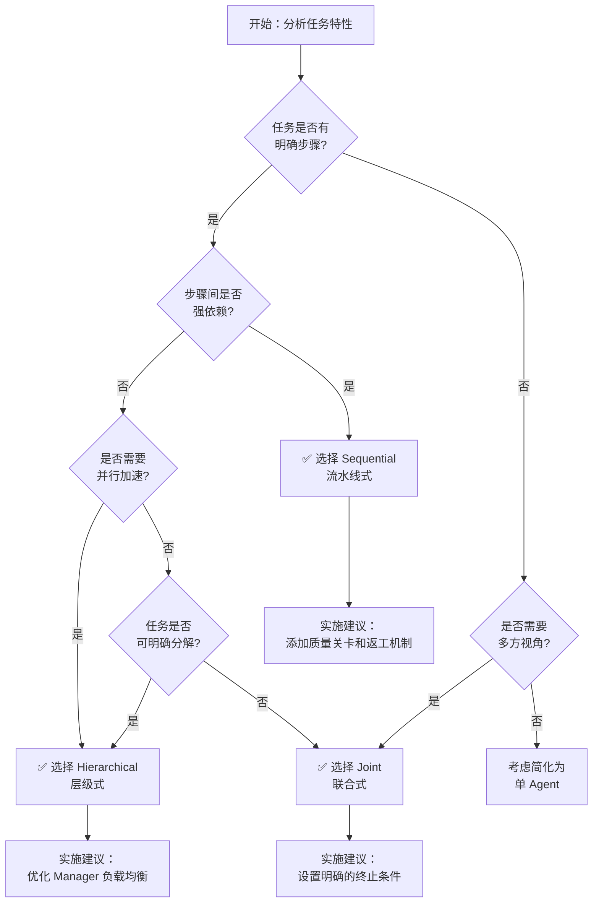

> **三个臭皮匠，顶个诸葛亮。但当皮匠们开始互相争吵时，可能连一个臭皮匠都不如。**

在前二十二篇文章中，我们深入探讨了从 Transformer 底层原理到 RAG 检索增强，再到 ReAct 推理框架和任务容错机制的完整技术栈。但我们一直聚焦于**单个 Agent** 的能力边界。

然而，现实世界中的复杂任务往往超出了单个模型的认知极限。就像人类社会中需要分工协作一样，当面对需要多维度专业知识、长链条推理或大规模并行处理的任务时，**多 Agent 系统（Multi-Agent Systems, MAS）** 成为了必然选择。

本篇是 **《AI 技术演进与核心算法实战》第五模块的第一篇**，正式开启**协作篇**的探索。我们将系统性地拆解三种主流的多 Agent 协作架构：**Hierarchical（层级式）**、**Sequential（流水线式）** 和 **Joint（联合式）**，并通过代码实战和可视化图解，帮助你理解如何根据业务场景选择合适的架构模式。

---

## 1. 为什么需要多 Agent 协作？

### 1.1 单 Agent 的能力瓶颈

在讨论多 Agent 之前，我们先回顾一下单个 LLM Agent 在面对复杂任务时的典型困境：

1. **上下文窗口限制**：即使是最先进的模型（如 GPT-4 Turbo 的 128K 窗口），也无法一次性处理百万字级别的企业知识库或长达数月的项目文档。
2. **角色冲突与注意力分散**：当你要求一个 Agent 同时扮演"资深程序员"、"产品经理"和"测试工程师"时，它往往会在不同角色间摇摆，导致输出质量下降。这被称为**角色混淆（Role Confusion）**。
3. **推理深度不足**：对于需要多轮迭代、反复验证的复杂问题（如编写一个完整的 Web 应用），单 Agent 容易陷入"浅层思考"，难以维持长期的目标一致性。
4. **工具调用混乱**：当可用的工具超过 10 个时，单 Agent 经常会出现工具选择错误、参数传递失误等问题，导致执行失败率飙升。

<details>
<summary>💡 实验数据：单 Agent vs 多 Agent 的性能对比</summary>

根据 Stanford CRFM 的研究，在处理需要多步骤、多领域知识的复杂任务时：
- **单 Agent** 的平均任务完成率为 **62%**
- **多 Agent 协作系统** 的平均任务完成率提升至 **87%**
- 特别是在代码生成、科学研究和数据分析领域，多 Agent 系统的优势更为明显

但需要注意的是，多 Agent 系统并非万能药。如果设计不当，反而会引入额外的通信开销和协调成本，导致性能**低于**单 Agent。这就是我们接下来要深入探讨的核心：**如何科学地设计多 Agent 协作架构**。
</details>

### 1.2 多 Agent 系统的核心价值

多 Agent 协作的本质是**通过分工、专业化和社会化互动，实现群体智能的涌现（Emergence）**。其核心价值体现在：

- **专业化分工**：每个 Agent 专注于特定领域（如代码生成、文档审查、测试验证），通过 Prompt 塑造差异化的人格和能力边界。
- **并行化处理**：多个 Agent 可以同时处理不同的子任务，显著缩短整体执行时间。
- **交叉验证与纠错**：不同 Agent 之间可以相互审查、辩论和修正，减少幻觉和错误。
- **模块化与可扩展性**：新增功能只需添加新的 Agent，无需重构整个系统。

---

## 2. 三种主流协作架构全景图

在深入研究每种架构之前，我们先通过一张全景图建立宏观认知。

<div align="center">
  <svg xmlns="http://www.w3.org/2000/svg" viewBox="0 0 800 500" width="100%" height="100%" style="max-width: 800px; margin: 20px 0;">
    <defs>
      <style>
        .box { fill: #f8fafc; stroke: #3b82f6; stroke-width: 2; rx: 8; ry: 8; }
        .box-hierarchical { fill: #dbeafe; stroke: #2563eb; stroke-width: 2; rx: 8; ry: 8; }
        .box-sequential { fill: #fef08a; stroke: #ca8a04; stroke-width: 2; rx: 8; ry: 8; }
        .box-joint { fill: #bbf7d0; stroke: #16a34a; stroke-width: 2; rx: 8; ry: 8; }
        .text { font-family: -apple-system, BlinkMacSystemFont, "Segoe UI", Roboto, sans-serif; font-size: 14px; fill: #1e293b; text-anchor: middle; dominant-baseline: middle; }
        .title { font-weight: bold; font-size: 16px; fill: #0f172a; }
        .arrow { stroke: #64748b; stroke-width: 2; marker-end: url(#arrowhead); fill: none; }
        .dashed-arrow { stroke: #94a3b8; stroke-width: 2; stroke-dasharray: 6,4; marker-end: url(#arrowhead); fill: none; }
      </style>
      <marker id="arrowhead" viewBox="0 0 10 10" refX="9" refY="5" markerWidth="6" markerHeight="6" orient="auto">
        <path d="M 0 0 L 10 5 L 0 10 z" fill="#64748b" />
      </marker>
    </defs>
    <!-- Title -->
    <text x="400" y="30" class="title" font-size="20">多 Agent 协作架构对比</text>
    <!-- Hierarchical Architecture -->
    <rect x="30" y="60" width="230" height="200" class="box" fill="none" stroke="#cbd5e1" stroke-width="2" rx="10" />
    <text x="145" y="85" class="title" fill="#2563eb">Hierarchical（层级式）</text>
    <rect x="100" y="100" width="90" height="40" class="box-hierarchical" />
    <text x="145" y="120" class="text" font-weight="bold">Manager</text>
    <rect x="50" y="170" width="60" height="35" class="box-hierarchical" />
    <text x="80" y="187" class="text" font-size="12">Agent A</text>
    <rect x="120" y="170" width="60" height="35" class="box-hierarchical" />
    <text x="150" y="187" class="text" font-size="12">Agent B</text>
    <rect x="190" y="170" width="60" height="35" class="box-hierarchical" />
    <text x="220" y="187" class="text" font-size="12">Agent C</text>
    <path d="M 145 140 L 80 170" class="arrow" />
    <path d="M 145 140 L 150 170" class="arrow" />
    <path d="M 145 140 L 220 170" class="arrow" />
    <text x="145" y="230" class="text" font-size="11" fill="#64748b">特点：中心化控制、明确分工</text>
    <text x="145" y="245" class="text" font-size="11" fill="#64748b">适用：复杂项目管理、多层决策</text>
    <!-- Sequential Architecture -->
    <rect x="285" y="60" width="230" height="200" class="box" fill="none" stroke="#cbd5e1" stroke-width="2" rx="10" />
    <text x="400" y="85" class="title" fill="#ca8a04">Sequential（流水线式）</text>
    <rect x="300" y="110" width="60" height="35" class="box-sequential" />
    <text x="330" y="127" class="text" font-size="12">Agent 1</text>
    <rect x="380" y="110" width="60" height="35" class="box-sequential" />
    <text x="410" y="127" class="text" font-size="12">Agent 2</text>
    <rect x="460" y="110" width="60" height="35" class="box-sequential" />
    <text x="490" y="127" class="text" font-size="12">Agent 3</text>
    <path d="M 360 127 L 380 127" class="arrow" />
    <path d="M 440 127 L 460 127" class="arrow" />
    <text x="400" y="170" class="text" font-size="11" fill="#64748b">↓ 输出传递给下一个 ↓</text>
    <rect x="300" y="190" width="220" height="35" class="box-sequential" fill="#fef9c3" />
    <text x="410" y="207" class="text" font-size="12">最终聚合结果</text>
    <text x="400" y="245" class="text" font-size="11" fill="#64748b">特点：线性流程、顺序依赖</text>
    <text x="400" y="260" class="text" font-size="11" fill="#64748b">适用：数据处理管道、内容创作</text>
    <!-- Joint Architecture -->
    <rect x="540" y="60" width="230" height="200" class="box" fill="none" stroke="#cbd5e1" stroke-width="2" rx="10" />
    <text x="655" y="85" class="title" fill="#16a34a">Joint（联合式）</text>
    <circle cx="600" cy="130" r="25" class="box-joint" />
    <text x="600" y="130" class="text" font-size="11">Agent A</text>
    <circle cx="710" cy="130" r="25" class="box-joint" />
    <text x="710" y="130" class="text" font-size="11">Agent B</text>
    <circle cx="600" cy="210" r="25" class="box-joint" />
    <text x="600" y="210" class="text" font-size="11">Agent C</text>
    <circle cx="710" cy="210" r="25" class="box-joint" />
    <text x="710" y="210" class="text" font-size="11">Agent D</text>
    <path d="M 620 140 L 690 140" class="dashed-arrow" />
    <path d="M 620 195 L 690 195" class="dashed-arrow" />
    <path d="M 600 155 L 600 185" class="dashed-arrow" />
    <path d="M 710 155 L 710 185" class="dashed-arrow" />
    <path d="M 615 145 L 695 195" class="dashed-arrow" />
    <path d="M 695 145 L 615 195" class="dashed-arrow" />
    <text x="655" y="245" class="text" font-size="11" fill="#64748b">特点：去中心化、自由通信</text>
    <text x="655" y="260" class="text" font-size="11" fill="#64748b">适用：开放讨论、头脑风暴</text>
    <!-- Bottom summary -->
    <rect x="30" y="280" width="740" height="200" class="box" fill="#f1f5f9" stroke="#94a3b8" stroke-width="2" rx="10" />
    <text x="400" y="310" class="title" font-size="18">架构选择决策指南</text>
    <text x="145" y="350" class="text" font-weight="bold" fill="#2563eb">Hierarchical</text>
    <text x="145" y="370" class="text" font-size="11">✓ 任务可明确分解</text>
    <text x="145" y="390" class="text" font-size="11">✓ 需要统一协调</text>
    <text x="145" y="410" class="text" font-size="11">✗  Manager 成为瓶颈</text>
    <text x="400" y="350" class="text" font-weight="bold" fill="#ca8a04">Sequential</text>
    <text x="400" y="370" class="text" font-size="11">✓ 流程清晰固定</text>
    <text x="400" y="390" class="text" font-size="11">✓ 步骤强依赖</text>
    <text x="400" y="410" class="text" font-size="11">✗ 无法并行优化</text>
    <text x="655" y="350" class="text" font-weight="bold" fill="#16a34a">Joint</text>
    <text x="655" y="370" class="text" font-size="11">✓ 需要创意碰撞</text>
    <text x="655" y="390" class="text" font-size="11">✓ 问题边界模糊</text>
    <text x="655" y="410" class="text" font-size="11">✗ 可能陷入死循环</text>
    <text x="400" y="450" class="text" font-size="12" fill="#64748b">实际工程中常采用混合架构，根据任务阶段动态切换协作模式</text>
  </svg>
</div>

---

## 3. Hierarchical（层级式）架构：中心化的指挥系统

### 3.1 核心设计思想

**Hierarchical 架构**模仿了人类组织的金字塔结构：一个 **Manager Agent** 负责任务分解、分配和结果整合，多个 **Worker Agents** 负责执行具体的子任务。

这种架构的核心特征是：**所有通信都必须经过 Manager，Worker 之间不能直接对话。**

<div align="center">
  <svg xmlns="http://www.w3.org/2000/svg" viewBox="0 0 700 400" width="100%" height="100%" style="max-width: 700px; margin: 20px 0;">
    <defs>
      <style>
        .manager { fill: #dbeafe; stroke: #2563eb; stroke-width: 3; rx: 10; ry: 10; }
        .worker { fill: #f8fafc; stroke: #3b82f6; stroke-width: 2; rx: 8; ry: 8; }
        .text { font-family: -apple-system, BlinkMacSystemFont, "Segoe UI", Roboto, sans-serif; font-size: 14px; fill: #1e293b; text-anchor: middle; dominant-baseline: middle; }
        .label { font-family: -apple-system, BlinkMacSystemFont, "Segoe UI", Roboto, sans-serif; font-size: 12px; fill: #64748b; text-anchor: middle; dominant-baseline: middle; }
        .arrow-down { stroke: #2563eb; stroke-width: 2.5; marker-end: url(#arrowdown); fill: none; }
        .arrow-up { stroke: #16a34a; stroke-width: 2.5; marker-end: url(#arrowup); fill: none; }
      </style>
      <marker id="arrowdown" viewBox="0 0 10 10" refX="9" refY="5" markerWidth="6" markerHeight="6" orient="auto">
        <path d="M 0 0 L 10 5 L 0 10 z" fill="#2563eb" />
      </marker>
      <marker id="arrowup" viewBox="0 0 10 10" refX="9" refY="5" markerWidth="6" markerHeight="6" orient="auto">
        <path d="M 0 0 L 10 5 L 0 10 z" fill="#16a34a" />
      </marker>
    </defs>
    <!-- User Input -->
    <rect x="250" y="20" width="200" height="40" class="worker" fill="#e0f2fe" />
    <text x="350" y="40" class="text" font-weight="bold">用户输入任务</text>
    <!-- Manager -->
    <rect x="250" y="100" width="200" height="60" class="manager" />
    <text x="350" y="125" class="text" font-weight="bold" font-size="16">Manager Agent</text>
    <text x="350" y="145" class="label">任务分解 · 分配 · 整合</text>
    <!-- Arrows from Manager to Workers -->
    <path d="M 300 160 L 150 230" class="arrow-down" />
    <text x="210" y="190" class="label" fill="#2563eb">分配子任务</text>
    <path d="M 350 160 L 350 230" class="arrow-down" />
    <text x="370" y="190" class="label" fill="#2563eb">分配子任务</text>
    <path d="M 400 160 L 550 230" class="arrow-down" />
    <text x="490" y="190" class="label" fill="#2563eb">分配子任务</text>
    <!-- Workers -->
    <rect x="80" y="230" width="140" height="50" class="worker" />
    <text x="150" y="250" class="text" font-weight="bold">Worker 1</text>
    <text x="150" y="268" class="label">代码生成专家</text>
    <rect x="280" y="230" width="140" height="50" class="worker" />
    <text x="350" y="250" class="text" font-weight="bold">Worker 2</text>
    <text x="350" y="268" class="label">文档编写专家</text>
    <rect x="480" y="230" width="140" height="50" class="worker" />
    <text x="550" y="250" class="text" font-weight="bold">Worker 3</text>
    <text x="550" y="268" class="label">测试验证专家</text>
    <!-- Arrows from Workers to Manager -->
    <path d="M 150 280 L 300 340" class="arrow-up" />
    <text x="210" y="315" class="label" fill="#16a34a">提交结果</text>
    <path d="M 350 280 L 350 340" class="arrow-up" />
    <text x="370" y="315" class="label" fill="#16a34a">提交结果</text>
    <path d="M 550 280 L 400 340" class="arrow-up" />
    <text x="490" y="315" class="label" fill="#16a34a">提交结果</text>
    <!-- Final Output -->
    <rect x="250" y="340" width="200" height="40" class="manager" fill="#bbf7d0" />
    <text x="350" y="360" class="text" font-weight="bold">整合输出给用户</text>
    <!-- Note -->
    <text x="350" y="395" class="label" font-style="italic">注意：Worker 之间没有直接连线，所有通信必须经过 Manager</text>
  </svg>
</div>

### 3.2 工作流程详解

让我们通过一个具体案例来理解 Hierarchical 架构的工作流程。假设我们要构建一个**自动化软件开发系统**，任务是从需求文档生成完整的 Web 应用代码。

#### 步骤 1：Manager 接收任务并分解

```python
# Manager Agent 的 Prompt 设计
MANAGER_PROMPT = """
你是一个资深技术项目经理。你的职责是：
1. 分析用户的开发需求
2. 将大任务拆解为可独立执行的子任务
3. 分配合适的 Worker Agent 执行
4. 整合所有 Worker 的输出，形成最终交付物

当前任务：{user_request}

请按照以下 JSON 格式输出任务分解方案：
{{
  "subtasks": [
    {{
      "id": 1,
      "description": "子任务描述",
      "assigned_agent": "code_writer | doc_writer | tester",
      "dependencies": []  // 依赖的子任务 ID 列表
    }}
  ]
}}
"""
```

#### 步骤 2：Worker Agents 并行执行

每个 Worker Agent 都有专业化的 System Prompt：

```python
# Code Writer Agent
CODE_WRITER_PROMPT = """
你是一名资深全栈工程师，精通 React、Node.js 和 PostgreSQL。
你的任务是编写高质量、可维护的代码。

要求：
- 遵循最佳实践和设计模式
- 添加详细的注释
- 考虑边界情况和错误处理
- 输出完整的代码文件
"""

# Documentation Writer Agent  
DOC_WRITER_PROMPT = """
你是一名技术文档专家，擅长编写清晰易懂的技术文档。
你的任务是为代码生成 README、API 文档和使用说明。

要求：
- 使用 Markdown 格式
- 包含安装指南、快速开始、API 参考
- 提供代码示例
"""

# Test Engineer Agent
TESTER_PROMPT = """
你是一名 QA 测试工程师，专注于编写全面的测试用例。
你的任务是为生成的代码创建单元测试和集成测试。

要求：
- 使用 Jest/Pytest 框架
- 覆盖正常流程和异常流程
- 测试覆盖率不低于 80%
"""
```

#### 步骤 3：Manager 整合结果

Manager 收到所有 Worker 的输出后，进行质量检查和整合：

```python
def manager_integrate_results(subtask_results: dict) -> str:
    """
    Manager 整合所有 Worker 的输出
    """
    integration_prompt = f"""
    以下是各个 Worker 完成的子任务结果：
    
    {json.dumps(subtask_results, indent=2, ensure_ascii=False)}
    
    请你：
    1. 检查各部分是否一致（如 API 接口定义是否匹配）
    2. 发现并指出潜在的冲突或遗漏
    3. 整合成完整的项目交付物
    4. 生成项目总结报告
    """
    
    final_output = llm.generate(integration_prompt)
    return final_output
```

### 3.3 代码实战：基于 LangGraph 实现 Hierarchical 架构

下面我们用 **LangGraph**（LangChain 官方推荐的多 Agent 编排框架）来实现一个简化的 Hierarchical 系统。

> 💡 **运行环境准备**：
> ```bash
> pip install langgraph langchain-openai
> ```

```python
from langgraph.graph import StateGraph, END
from typing import TypedDict, List, Dict, Any
from langchain_openai import ChatOpenAI
import json

# 定义状态结构
class TeamState(TypedDict):
    user_request: str
    subtasks: List[Dict[str, Any]]
    worker_results: Dict[str, str]
    final_output: str

# 初始化 LLM
llm = ChatOpenAI(model="gpt-4-turbo", temperature=0)

# === Manager Node ===
def manager_node(state: TeamState) -> TeamState:
    """Manager 负责任务分解"""
    prompt = f"""
    你是技术经理。请将以下开发任务拆解为 3 个子任务：
    任务：{state['user_request']}
    
    子任务分配给：code_writer（代码）、doc_writer（文档）、tester（测试）
    以 JSON 数组格式返回。
    """
    response = llm.invoke(prompt)
    
    # 解析 JSON（实际生产中需要更健壮的解析逻辑）
    try:
        subtasks = json.loads(response.content)
    except:
        subtasks = [
            {"id": 1, "agent": "code_writer", "task": "编写核心代码"},
            {"id": 2, "agent": "doc_writer", "task": "编写文档"},
            {"id": 3, "agent": "tester", "task": "编写测试"}
        ]
    
    state['subtasks'] = subtasks
    return state

# === Worker Nodes ===
def code_writer_node(state: TeamState) -> TeamState:
    """代码编写 Worker"""
    task = next((t for t in state['subtasks'] if t['agent'] == 'code_writer'), None)
    if not task:
        return state
    
    prompt = f"""
    你是资深程序员。完成以下任务：
    {task['task']}
    
    原始需求：{state['user_request']}
    
    请直接输出代码。
    """
    result = llm.invoke(prompt)
    state['worker_results']['code_writer'] = result.content
    return state

def doc_writer_node(state: TeamState) -> TeamState:
    """文档编写 Worker"""
    task = next((t for t in state['subtasks'] if t['agent'] == 'doc_writer'), None)
    if not task:
        return state
    
    prompt = f"""
    你是技术文档专家。完成以下任务：
    {task['task']}
    
    原始需求：{state['user_request']}
    
    请直接输出 Markdown 文档。
    """
    result = llm.invoke(prompt)
    state['worker_results']['doc_writer'] = result.content
    return state

def tester_node(state: TeamState) -> TeamState:
    """测试编写 Worker"""
    task = next((t for t in state['subtasks'] if t['agent'] == 'tester'), None)
    if not task:
        return state
    
    prompt = f"""
    你是 QA 工程师。完成以下任务：
    {task['task']}
    
    原始需求：{state['user_request']}
    
    请直接输出测试代码。
    """
    result = llm.invoke(prompt)
    state['worker_results']['tester'] = result.content
    return state

# === Integrator Node (也是 Manager) ===
def integrator_node(state: TeamState) -> TeamState:
    """Manager 整合所有结果"""
    prompt = f"""
    你是技术经理。以下是团队完成的工作：
    
    代码：
    {state['worker_results'].get('code_writer', 'N/A')}
    
    文档：
    {state['worker_results'].get('doc_writer', 'N/A')}
    
    测试：
    {state['worker_results'].get('tester', 'N/A')}
    
    请整合成完整的项目交付报告，包括：
    1. 项目概述
    2. 代码结构说明
    3. 使用指南
    4. 测试说明
    """
    result = llm.invoke(prompt)
    state['final_output'] = result.content
    return state

# === 构建图 ===
workflow = StateGraph(TeamState)

# 添加节点
workflow.add_node("manager", manager_node)
workflow.add_node("code_writer", code_writer_node)
workflow.add_node("doc_writer", doc_writer_node)
workflow.add_node("tester", tester_node)
workflow.add_node("integrator", integrator_node)

# 定义边（控制流）
workflow.set_entry_point("manager")

# Manager 分解后，三个 Worker 并行执行
workflow.add_edge("manager", "code_writer")
workflow.add_edge("manager", "doc_writer")
workflow.add_edge("manager", "tester")

# 所有 Worker 完成后，进入整合阶段
workflow.add_edge("code_writer", "integrator")
workflow.add_edge("doc_writer", "integrator")
workflow.add_edge("tester", "integrator")

workflow.add_edge("integrator", END)

# 编译图
app = workflow.compile()

# === 执行 ===
initial_state = {
    "user_request": "创建一个待办事项管理应用，支持增删改查和分类功能",
    "subtasks": [],
    "worker_results": {},
    "final_output": ""
}

result = app.invoke(initial_state)
print(result['final_output'])
```

### 3.4 优势与局限性分析

#### ✅ 优势

1. **清晰的职责边界**：每个 Agent 只关注自己的专业领域，避免角色混淆。
2. **易于调试和优化**：可以单独改进某个 Worker 的 Prompt 或替换模型，不影响其他部分。
3. **可扩展性强**：新增功能只需添加新的 Worker，Manager 的任务分配逻辑自动适配。
4. **适合复杂项目管理**：能够处理具有多层依赖关系的任务，类似真实的企业研发团队。

#### ❌ 局限性

1. **Manager 成为性能瓶颈**：所有通信都经过 Manager，当 Worker 数量增加时，Manager 的上下文窗口和推理压力会急剧上升。
2. **信息损失风险**：Worker 之间的间接沟通可能导致细节丢失。例如，Code Writer 修改了 API 接口，但 Tester 不知道，导致测试用例过时。
3. **单点故障**：如果 Manager 出错（如任务分解不合理），整个系统都会失败。
4. **缺乏灵活性**：Worker 无法主动协作解决问题，必须等待 Manager 的指令。

<details>
<summary>💡 工程实践建议</summary>

- **分层 Manager**：对于超大规模任务，可以引入多层 Manager（如 Project Manager → Tech Lead → Developer），形成树状结构。
- **共享记忆**：使用向量数据库或知识图谱作为共享黑板（Blackboard），让 Worker 可以查询其他 Worker 的输出，减少信息孤岛。
- **动态路由**：根据任务类型动态选择激活哪些 Worker，而不是每次都调用所有 Worker，节省成本。
</details>

---

## 4. Sequential（流水线式）架构：有序的接力赛

### 4.1 核心设计思想

**Sequential 架构**将任务处理过程组织成一个**线性管道（Pipeline）**，每个 Agent 的输出作为下一个 Agent 的输入，像工厂流水线一样有序传递。

这种架构的核心特征是：**严格的顺序依赖，前一步未完成，后一步无法开始。**

<div align="center">
  <svg xmlns="http://www.w3.org/2000/svg" viewBox="0 0 750 350" width="100%" height="100%" style="max-width: 750px; margin: 20px 0;">
    <defs>
      <style>
        .stage { fill: #fef08a; stroke: #ca8a04; stroke-width: 2.5; rx: 10; ry: 10; }
        .input-output { fill: #e0f2fe; stroke: #0284c7; stroke-width: 2; rx: 8; ry: 8; }
        .text { font-family: -apple-system, BlinkMacSystemFont, "Segoe UI", Roboto, sans-serif; font-size: 14px; fill: #1e293b; text-anchor: middle; dominant-baseline: middle; }
        .label { font-family: -apple-system, BlinkMacSystemFont, "Segoe UI", Roboto, sans-serif; font-size: 12px; fill: #64748b; text-anchor: middle; dominant-baseline: middle; }
        .arrow { stroke: #ca8a04; stroke-width: 3; marker-end: url(#arrowseq); fill: none; }
      </style>
      <marker id="arrowseq" viewBox="0 0 10 10" refX="9" refY="5" markerWidth="6" markerHeight="6" orient="auto">
        <path d="M 0 0 L 10 5 L 0 10 z" fill="#ca8a04" />
      </marker>
    </defs>
    <!-- Input -->
    <rect x="20" y="140" width="100" height="50" class="input-output" />
    <text x="70" y="160" class="text" font-weight="bold">原始输入</text>
    <text x="70" y="178" class="label">用户需求</text>
    <!-- Arrow to Stage 1 -->
    <path d="M 120 165 L 160 165" class="arrow" />
    <!-- Stage 1 -->
    <rect x="160" y="130" width="110" height="70" class="stage" />
    <text x="215" y="155" class="text" font-weight="bold">Agent 1</text>
    <text x="215" y="175" class="label">需求分析</text>
    <text x="215" y="192" class="label">提取关键信息</text>
    <!-- Arrow to Stage 2 -->
    <path d="M 270 165 L 310 165" class="arrow" />
    <text x="290" y="150" class="label" fill="#ca8a04">结构化数据</text>
    <!-- Stage 2 -->
    <rect x="310" y="130" width="110" height="70" class="stage" />
    <text x="365" y="155" class="text" font-weight="bold">Agent 2</text>
    <text x="365" y="175" class="label">方案设计</text>
    <text x="365" y="192" class="label">制定执行计划</text>
    <!-- Arrow to Stage 3 -->
    <path d="M 420 165 L 460 165" class="arrow" />
    <text x="440" y="150" class="label" fill="#ca8a04">技术方案</text>
    <!-- Stage 3 -->
    <rect x="460" y="130" width="110" height="70" class="stage" />
    <text x="515" y="155" class="text" font-weight="bold">Agent 3</text>
    <text x="515" y="175" class="label">代码实现</text>
    <text x="515" y="192" class="label">生成可执行代码</text>
    <!-- Arrow to Stage 4 -->
    <path d="M 570 165 L 610 165" class="arrow" />
    <text x="590" y="150" class="label" fill="#ca8a04">代码 + 注释</text>
    <!-- Stage 4 -->
    <rect x="610" y="130" width="110" height="70" class="stage" />
    <text x="665" y="155" class="text" font-weight="bold">Agent 4</text>
    <text x="665" y="175" class="label">质量审查</text>
    <text x="665" y="192" class="label">优化与修正</text>
    <!-- Arrow to Output -->
    <path d="M 720 165 L 760 165" class="arrow" />
    <!-- Output -->
    <rect x="760" y="140" width="100" height="50" class="input-output" fill="#bbf7d0" />
    <text x="810" y="160" class="text" font-weight="bold">最终输出</text>
    <text x="810" y="178" class="label">交付成果</text>
    <!-- Timeline indicator -->
    <line x1="70" y1="250" x2="810" y2="250" stroke="#94a3b8" stroke-width="2" />
    <text x="70" y="270" class="label">T0</text>
    <text x="215" y="270" class="label">T1</text>
    <text x="365" y="270" class="label">T2</text>
    <text x="515" y="270" class="label">T3</text>
    <text x="665" y="270" class="label">T4</text>
    <text x="810" y="270" class="label">T5</text>
    <text x="440" y="300" class="label" font-style="italic">时间轴：每个阶段必须等待前一阶段完成</text>
    <!-- Feedback loop (optional) -->
    <path d="M 665 200 Q 665 230 515 230 Q 465 230 465 200" stroke="#ef4444" stroke-width="2" stroke-dasharray="5,5" fill="none" marker-end="url(#arrowseq)" />
    <text x="565" y="245" class="label" fill="#ef4444">可选：返工循环</text>
  </svg>
</div>

### 4.2 典型应用场景

Sequential 架构最适合**具有明确先后顺序的处理流程**，例如：

1. **内容创作管道**：选题策划 → 大纲生成 → 初稿撰写 → 编辑润色 → 事实核查
2. **数据处理 ETL**：数据清洗 → 特征提取 → 模型预测 → 结果格式化
3. **代码开发流程**：需求分析 → 架构设计 → 编码实现 → 代码审查 → 测试生成
4. **客户服务工单**：问题分类 → 信息查询 → 方案生成 → 语气优化 → 最终回复

### 4.3 代码实战：构建内容创作流水线

我们以**自动化博客文章生成系统**为例，展示 Sequential 架构的实现。

```python
from typing import TypedDict
from langchain_openai import ChatOpenAI
from langgraph.graph import StateGraph, END

# 定义状态
class ContentPipelineState(TypedDict):
    topic: str                    # 主题
    outline: str                  # 大纲
    draft: str                    # 初稿
    polished_article: str         # 润色后的文章
    fact_checked_article: str     # 事实核查后的文章

llm = ChatOpenAI(model="gpt-4-turbo", temperature=0.7)

# === Stage 1: 大纲生成器 ===
def outline_generator(state: ContentPipelineState) -> ContentPipelineState:
    """根据主题生成文章大纲"""
    prompt = f"""
    你是一名资深内容策划师。请为主题 "{state['topic']}" 生成详细的博客文章大纲。
    
    要求：
    - 包含 5-7 个主要章节
    - 每个章节有 2-3 个子要点
    - 符合 SEO 最佳实践
    - 以 Markdown 格式输出
    """
    response = llm.invoke(prompt)
    state['outline'] = response.content
    return state

# === Stage 2: 初稿撰写者 ===
def draft_writer(state: ContentPipelineState) -> ContentPipelineState:
    """根据大纲撰写初稿"""
    prompt = f"""
    你是一名专业博主。请根据以下大纲撰写一篇完整的博客文章初稿。
    
    主题：{state['topic']}
    
    大纲：
    {state['outline']}
    
    要求：
    - 字数在 2000-3000 字之间
    - 语言通俗易懂，深入浅出
    - 包含实际案例和代码示例
    - 不要担心语法和格式的完美，先完成再完善
    """
    response = llm.invoke(prompt)
    state['draft'] = response.content
    return state

# === Stage 3: 编辑润色器 ===
def editor_polisher(state: ContentPipelineState) -> ContentPipelineState:
    """对初稿进行润色和优化"""
    prompt = f"""
    你是一名资深编辑。请对以下博客文章初稿进行润色。
    
    初稿：
    {state['draft']}
    
    任务：
    1. 优化语言表达，使其更流畅自然
    2. 修正语法错误和拼写错误
    3. 改善段落结构和过渡
    4. 增强可读性（使用短句、列表、加粗等）
    5. 保持原文的核心内容和观点不变
    
    输出润色后的完整文章。
    """
    response = llm.invoke(prompt)
    state['polished_article'] = response.content
    return state

# === Stage 4: 事实核查员 ===
def fact_checker(state: ContentPipelineState) -> ContentPipelineState:
    """核查文章中的事实和数据"""
    prompt = f"""
    你是一名严谨的事实核查员。请检查以下文章中可能存在的事实错误、过时信息或不准确的陈述。
    
    文章：
    {state['polished_article']}
    
    任务：
    1. 识别所有需要核实的事实声明（如统计数据、日期、人名、技术细节）
    2. 标记可疑或不准确的内容
    3. 提供修正建议
    4. 输出最终版本的文章，已修正所有已知错误
    
    注意：如果某些事实无法在当前上下文中核实，请添加 [需进一步核实] 标记。
    """
    response = llm.invoke(prompt)
    state['fact_checked_article'] = response.content
    return state

# === 条件路由：是否需要返工？===
def should_revise(state: ContentPipelineState) -> str:
    """判断文章质量是否达标，决定是否需要返工"""
    prompt = f"""
    你是一名主编。请评估以下文章的质量：
    
    {state['fact_checked_article'][:2000]}  # 只检查前 2000 字符以节省成本
    
    评分标准（1-10 分）：
    - 内容准确性
    - 逻辑连贯性
    - 语言流畅度
    - 读者友好性
    
    如果总分低于 7 分，返回 "revise"；否则返回 "publish"。
    只返回一个单词：revise 或 publish
    """
    response = llm.invoke(prompt).content.strip().lower()
    return "revise" if "revise" in response else "publish"

# === 构建工作流 ===
workflow = StateGraph(ContentPipelineState)

# 添加节点
workflow.add_node("outline_generator", outline_generator)
workflow.add_node("draft_writer", draft_writer)
workflow.add_node("editor_polisher", editor_polisher)
workflow.add_node("fact_checker", fact_checker)

# 定义线性流程
workflow.set_entry_point("outline_generator")
workflow.add_edge("outline_generator", "draft_writer")
workflow.add_edge("draft_writer", "editor_polisher")
workflow.add_edge("editor_polisher", "fact_checker")

# 条件分支：发布或返工
workflow.add_conditional_edges(
    "fact_checker",
    should_revise,
    {
        "revise": "draft_writer",  # 返回到初稿阶段重新撰写
        "publish": END
    }
)

# 编译
app = workflow.compile()

# === 执行 ===
initial_state = {
    "topic": "如何使用 Python 构建高性能的异步 Web 爬虫",
    "outline": "",
    "draft": "",
    "polished_article": "",
    "fact_checked_article": ""
}

result = app.invoke(initial_state)
print("=== 最终文章 ===")
print(result['fact_checked_article'])
```

### 4.4 优势与局限性分析

#### ✅ 优势

1. **流程清晰可控**：每个阶段的输入输出明确，易于理解和维护。
2. **专业化程度高**：每个 Agent 可以针对特定任务进行深度优化（如选择不同的模型、温度参数）。
3. **便于质量关卡设置**：可以在任意阶段插入审核节点，不合格则终止或返工。
4. **符合人类工作习惯**：大多数业务流程本身就是线性的，容易映射到现实世界。

#### ❌ 局限性

1. **串行执行效率低**：无法利用并行计算，整体耗时等于各阶段耗时之和。
2. **错误累积效应**：前面阶段的错误会传递到后续所有阶段，且越往后修正成本越高。
3. **缺乏全局视野**：每个 Agent 只能看到前一步的输出，无法理解任务的完整上下文。
4. **刚性流程不灵活**：难以应对需要回溯或跳跃的非线性任务。

<details>
<summary>💡 性能优化技巧</summary>

- **批处理**：如果有多个独立任务（如生成 10 篇文章），可以并行启动多个流水线实例。
- **缓存中间结果**：对于不变的输入（如同一份数据源），缓存前期阶段的输出，避免重复计算。
- **智能跳过**：对于简单任务，可以动态跳过某些阶段（如不需要事实核查的创意写作）。
- **异步执行**：虽然逻辑上是串行的，但可以使用异步 I/O 减少等待时间（如同时调用多个外部 API）。
</details>

---

## 5. Joint（联合式）架构：去中心化的圆桌会议

### 5.1 核心设计思想

**Joint 架构**（也称为 Collaborative 或 Peer-to-Peer 架构）中，所有 Agent 处于**平等地位**，可以自由地相互通信、辩论和协作，没有中心控制器或固定顺序。

这种架构的核心特征是：**多对多通信、动态交互、自组织协作。**

<div align="center">
  <svg xmlns="http://www.w3.org/2000/svg" viewBox="0 0 700 500" width="100%" height="100%" style="max-width: 700px; margin: 20px 0;">
    <defs>
      <style>
        .agent { fill: #bbf7d0; stroke: #16a34a; stroke-width: 2.5; rx: 50; ry: 50; }
        .text { font-family: -apple-system, BlinkMacSystemFont, "Segoe UI", Roboto, sans-serif; font-size: 14px; fill: #1e293b; text-anchor: middle; dominant-baseline: middle; }
        .label { font-family: -apple-system, BlinkMacSystemFont, "Segoe UI", Roboto, sans-serif; font-size: 12px; fill: #64748b; text-anchor: middle; dominant-baseline: middle; }
        .comm-line { stroke: #16a34a; stroke-width: 1.5; stroke-dasharray: 6,4; marker-end: url(#arrowjoint); fill: none; opacity: 0.6; }
        .active-comm { stroke: #ef4444; stroke-width: 2.5; marker-end: url(#arrowjoint); fill: none; }
      </style>
      <marker id="arrowjoint" viewBox="0 0 10 10" refX="9" refY="5" markerWidth="6" markerHeight="6" orient="auto">
        <path d="M 0 0 L 10 5 L 0 10 z" fill="#16a34a" />
      </marker>
    </defs>
    <!-- Central shared space -->
    <circle cx="350" cy="250" r="150" fill="#f0fdf4" stroke="#86efac" stroke-width="2" stroke-dasharray="8,6" />
    <text x="350" y="250" class="label" font-size="14" fill="#16a34a" font-weight="bold">共享黑板</text>
    <text x="350" y="270" class="label" font-size="11">(Shared Blackboard)</text>
    <!-- Agent 1 (Top) -->
    <rect x="300" y="50" width="100" height="60" class="agent" />
    <text x="350" y="75" class="text" font-weight="bold">Agent A</text>
    <text x="350" y="95" class="label">产品经理</text>
    <!-- Agent 2 (Right) -->
    <rect x="550" y="220" width="100" height="60" class="agent" />
    <text x="600" y="245" class="text" font-weight="bold">Agent B</text>
    <text x="600" y="265" class="label">技术架构师</text>
    <!-- Agent 3 (Bottom) -->
    <rect x="300" y="390" width="100" height="60" class="agent" />
    <text x="350" y="415" class="text" font-weight="bold">Agent C</text>
    <text x="350" y="435" class="label">用户体验设计师</text>
    <!-- Agent 4 (Left) -->
    <rect x="50" y="220" width="100" height="60" class="agent" />
    <text x="100" y="245" class="text" font-weight="bold">Agent D</text>
    <text x="100" y="265" class="label">安全专家</text>
    <!-- Communication lines (all-to-all) -->
    <path d="M 350 110 L 570 230" class="comm-line" />
    <path d="M 570 250 L 350 390" class="comm-line" />
    <path d="M 350 390 L 130 270" class="comm-line" />
    <path d="M 130 230 L 350 110" class="comm-line" />
    <!-- Cross communications -->
    <path d="M 380 80 L 570 220" class="comm-line" />
    <path d="M 600 280 L 380 390" class="comm-line" />
    <path d="M 320 390 L 130 270" class="comm-line" />
    <path d="M 100 220 L 320 80" class="comm-line" />
    <!-- Active communication example -->
    <path d="M 350 110 Q 450 150 570 230" class="active-comm" />
    <text x="470" y="160" class="label" fill="#ef4444" font-weight="bold">正在讨论...</text>
    <!-- Message bubbles -->
    <ellipse cx="480" cy="170" rx="60" ry="25" fill="#ffffff" stroke="#ef4444" stroke-width="2" />
    <text x="480" y="170" class="label" font-size="10">"这个方案可行吗？"</text>
    <!-- Legend -->
    <rect x="20" y="470" width="200" height="25" fill="none" />
    <line x1="20" y1="482" x2="50" y2="482" stroke="#16a34a" stroke-width="1.5" stroke-dasharray="6,4" />
    <text x="120" y="485" class="label" font-size="11">潜在通信路径</text>
    <line x1="180" y1="482" x2="210" y2="482" stroke="#ef4444" stroke-width="2.5" />
    <text x="280" y="485" class="label" font-size="11">活跃对话</text>
    <text x="350" y="495" class="label" font-style="italic">所有 Agent 可以自由选择与谁交流、何时交流</text>
  </svg>
</div>

### 5.2 通信机制与共识达成

Joint 架构的最大挑战是**如何避免混乱**。如果没有良好的协调机制，多个 Agent 同时发言会导致：
- **信息过载**：每个 Agent 被淹没在大量消息中
- **死循环**：Agent A 和 Agent B 反复争论同一个问题
- **目标漂移**：讨论偏离原始任务

为此，Joint 架构通常采用以下机制：

#### 1. 共享黑板（Shared Blackboard）

所有 Agent 将中间结果、观点和疑问写入一个共享的知识库（可以是内存字典、向量数据库或关系型数据库）。其他 Agent 可以读取黑板上的信息，并选择性回应。

```python
# 共享黑板的数据结构示例
class SharedBlackboard:
    def __init__(self):
        self.messages: List[Dict] = []          # 所有消息历史
        self.current_proposal: Optional[str] = None  # 当前提案
        self.votes: Dict[str, int] = {}          # 投票结果
        self.consensus_reached: bool = False     # 是否达成共识
    
    def post_message(self, agent_name: str, content: str, message_type: str):
        """Agent 发布消息"""
        self.messages.append({
            "agent": agent_name,
            "content": content,
            "type": message_type,  # "proposal", "critique", "support", "question"
            "timestamp": time.time()
        })
    
    def get_recent_context(self, n: int = 10) -> str:
        """获取最近 N 条消息作为上下文"""
        recent = self.messages[-n:]
        return "\n".join([f"[{m['agent']}]: {m['content']}" for m in recent])
```

#### 2. 发言权控制（Turn-Taking）

为了避免多个 Agent 同时发言，可以引入**轮询机制**或**基于优先级的调度**：

- **轮询**：按固定顺序轮流发言（A → B → C → A...）
- **优先级**：根据消息类型分配优先级（如"反对意见"优先于"补充说明"）
- **事件驱动**：只有当黑板上出现特定关键词时，相关 Agent 才被激活

#### 3. 终止条件

Joint 架构必须有明确的停止机制，否则会无限循环：

- **最大迭代次数**：最多进行 N 轮讨论
- **共识阈值**：当超过 X% 的 Agent 同意某个方案时停止
- **稳定性检测**：连续 M 轮没有新观点提出时停止
- **外部中断**：用户手动终止

### 5.3 代码实战：多 Agent 辩论系统

我们实现一个**产品方案评审系统**，其中四个 Agent（产品经理、技术架构师、UX 设计师、安全专家）围绕一个产品方案展开辩论，最终达成共识。

```python
from typing import TypedDict, List
from langchain_openai import ChatOpenAI
import time

class DebateState(TypedDict):
    topic: str
    blackboard: List[Dict]
    round_count: int
    consensus: str

class MultiAgentDebate:
    def __init__(self):
        self.llm = ChatOpenAI(model="gpt-4-turbo", temperature=0.8)
        self.blackboard = []
        
        # 定义不同角色的 Agent
        self.agents = {
            "product_manager": {
                "role": "产品经理",
                "prompt": """你是一名注重市场需求和用户增长的产品经理。
                你的目标是确保产品方案能够满足用户需求并具有商业价值。
                关注点：市场机会、用户痛点、商业模式、竞争优势"""
            },
            "tech_architect": {
                "role": "技术架构师",
                "prompt": """你是一名务实的技术架构师。
                你的目标是评估技术可行性、成本和风险。
                关注点：技术栈选择、系统架构、性能瓶颈、开发周期、维护成本"""
            },
            "ux_designer": {
                "role": "用户体验设计师",
                "prompt": """你是一名以用户为中心的 UX 设计师。
                你的目标是确保产品易用、直观且令人愉悦。
                关注点：用户界面、交互流程、可访问性、用户反馈"""
            },
            "security_expert": {
                "role": "安全专家",
                "prompt": """你是一名谨慎的安全专家。
                你的目标是识别潜在的安全风险和合规问题。
                关注点：数据隐私、身份认证、授权机制、攻击面、合规要求"""
            }
        }
    
    def agent_speak(self, agent_key: str, state: DebateState) -> str:
        """单个 Agent 发言"""
        agent_info = self.agents[agent_key]
        
        # 构建上下文
        context = "\n".join([
            f"[{msg['agent']}]: {msg['content']}" 
            for msg in state['blackboard'][-8:]  # 只看最近 8 条消息
        ])
        
        prompt = f"""
        {agent_info['prompt']}
        
        讨论主题：{state['topic']}
        
        当前讨论历史：
        {context if context else "（讨论刚开始）"}
        
        轮到你发言。请：
        1. 从你的专业角度分析当前方案
        2. 提出建设性意见或指出潜在问题
        3. 如果已有共识，可以表示支持
        4. 控制在 150 字以内，简洁有力
        
        你的发言：
        """
        
        response = self.llm.invoke(prompt)
        return response.content
    
    def check_consensus(self, state: DebateState) -> bool:
        """检测是否达成共识"""
        if len(state['blackboard']) < 8:  # 至少 2 轮讨论
            return False
        
        # 让 LLM 判断是否达成共识
        recent_messages = "\n".join([
            f"[{msg['agent']}]: {msg['content']}"
            for msg in state['blackboard'][-8:]
        ])
        
        prompt = f"""
        以下是多 Agent 讨论的最后几轮：
        
        {recent_messages}
        
        请判断：各方是否已就核心问题达成共识？
        - 如果仍有明显分歧，返回 "NO"
        - 如果已基本达成一致，返回 "YES" 并简要总结共识内容
        
        格式：
        CONSENSUS: YES/NO
        SUMMARY: （如果是 YES，用一句话总结共识）
        """
        
        response = self.llm.invoke(prompt).content
        return "YES" in response.upper(), response
    
    def run_debate(self, topic: str, max_rounds: int = 5) -> DebateState:
        """运行辩论流程"""
        state = DebateState(
            topic=topic,
            blackboard=[],
            round_count=0,
            consensus=""
        )
        
        print(f"🎯 开始讨论主题：{topic}\n")
        
        for round_num in range(max_rounds):
            state['round_count'] = round_num + 1
            print(f"--- 第 {round_num + 1} 轮讨论 ---")
            
            # 每个 Agent 依次发言
            for agent_key, agent_info in self.agents.items():
                speech = self.agent_speak(agent_key, state)
                
                # 记录到黑板
                state['blackboard'].append({
                    "agent": agent_info['role'],
                    "content": speech,
                    "round": round_num + 1
                })
                
                print(f"[{agent_info['role']}]: {speech}\n")
            
            # 检查是否达成共识
            reached, summary = self.check_consensus(state)
            if reached:
                state['consensus'] = summary
                print(f"✅ 达成共识！\n{summary}\n")
                break
        else:
            print("⚠️ 达到最大轮数，强制结束讨论\n")
            # 生成最终总结
            state['consensus'] = self.generate_final_summary(state)
        
        return state
    
    def generate_final_summary(self, state: DebateState) -> str:
        """生成最终总结"""
        all_messages = "\n".join([
            f"[{msg['agent']}]: {msg['content']}"
            for msg in state['blackboard']
        ])
        
        prompt = f"""
        以下是关于 "{state['topic']}" 的多 Agent 讨论记录：
        
        {all_messages}
        
        请作为主持人总结：
        1. 各方的主要观点
        2. 达成的共识（如有）
        3. 仍存在的分歧（如有）
        4. 下一步行动建议
        """
        
        return self.llm.invoke(prompt).content

# === 使用示例 ===
de bate_system = MultiAgentDebate()

result = debate_system.run_debate(
    topic="开发一款基于 AI 的个人健康管理 App，支持饮食记录、运动追踪和健康建议",
    max_rounds=4
)

print("\n=== 最终总结 ===")
print(result['consensus'])
```

### 5.4 优势与局限性分析

#### ✅ 优势

1. **激发创造性思维**：不同视角的碰撞往往能产生意想不到的创新方案。
2. **全面的风险识别**：多个专业领域的 Agent 可以从不同角度发现潜在问题。
3. **鲁棒性强**：没有单点故障，即使某个 Agent 表现不佳，其他 Agent 可以弥补。
4. **适应模糊任务**：对于没有明确解决方案的开放式问题，Joint 架构能够通过探索找到最优解。

#### ❌ 局限性

1. **通信开销巨大**：N 个 Agent 之间最多有 N*(N-1)/2 条通信链路，消息数量呈指数级增长。
2. **难以控制方向**：讨论可能偏离主题，陷入无意义的争论或重复。
3. **收敛速度慢**：达成共识可能需要多轮迭代，耗时较长。
4. **实现复杂度高**：需要精心设计消息路由、冲突解决和终止机制。

<details>
<summary>💡 最佳实践建议</summary>

- **限制参与人数**：通常 3-5 个 Agent 为宜，过多会导致混乱。
- **设定明确议程**：每轮讨论聚焦一个子问题，避免泛泛而谈。
- **引入调解者**：可以添加一个 Moderator Agent，负责引导讨论方向和总结阶段性成果。
- **混合架构**：在实际工程中，Joint 架构常作为 Hierarchical 架构中的一个环节（如方案评审阶段），而非独立使用。
</details>

---

## 6. 三大架构横向对比与选型指南

为了帮助你更好地选择合适的架构，我们从多个维度进行对比：

| 对比维度 | Hierarchical（层级式） | Sequential（流水线式） | Joint（联合式） |
| :--- | :--- | :--- | :--- |
| **控制方式** | 中心化（Manager 控制） | 线性流程（固定顺序） | 去中心化（自由交互） |
| **通信模式** | 星型拓扑（Manager ↔ Workers） | 链式拓扑（A → B → C） | 网状拓扑（全连接） |
| **并行能力** | ✅ 高（Workers 可并行） | ❌ 低（严格串行） | ⚠️ 中（取决于协调机制） |
| **复杂度** | 中等 | 低 | 高 |
| **可扩展性** | ✅ 优秀（易添加新 Worker） | ⚠️ 一般（需调整流程） | ❌ 较差（通信爆炸） |
| **容错性** | ⚠️ 中等（Manager 是单点故障） | ❌ 低（错误累积） | ✅ 高（冗余性强） |
| **适用场景** | 复杂项目管理、多层决策 | 数据处理管道、内容创作 | 开放讨论、创意 brainstorming |
| **典型框架** | AutoGen, CrewAI | LangChain Pipeline, Haystack | CamelAI, ChatDev |
| **开发难度** | ⭐⭐⭐ | ⭐⭐ | ⭐⭐⭐⭐⭐ |
| **运行成本** | 中等 | 低 | 高（消息多） |

### 选型决策树



### 混合架构：实际工程的最佳选择

在真实的生产系统中，**很少使用单一的纯架构**，更多是采用**混合架构**，根据不同阶段的特点动态切换协作模式。

**典型案例：智能代码生成平台**

1. **需求分析阶段（Joint）**：产品经理、技术负责人、UX 设计师共同讨论，明确需求和约束。
2. **任务分解阶段（Hierarchical）**：Tech Lead 将大任务拆分为模块，分配给不同的开发小组。
3. **代码实现阶段（Sequential + Hierarchical）**：
   - 每个小组内部采用 Sequential 流程：设计 → 编码 → 测试
   - 多个小组并行工作（Hierarchical 的并行特性）
4. **集成测试阶段（Joint）**：所有模块完成后，多个测试 Agent 协作进行集成测试和问题定位。

---

## 7. 前沿研究与未来趋势

多 Agent 系统是当前 AI 研究的最前沿领域之一，以下是一些值得关注的方向：

### 7.1 群体智能的涌现（Emergent Collective Intelligence）

斯坦福大学的 **Generative Agents** 实验表明，当数十个 Agent 在虚拟环境中长期互动时，会自发形成社会网络、传播谣言、组织活动，甚至产生类似人类的情感共鸣。这提示我们：**足够复杂的 Agent 社会可能涌现出超越个体能力的集体智慧。**

### 7.2 自动 Agent 编排（Auto-Agent Orchestration）

未来的系统将不再由人工设计 Agent 数量和角色，而是由一个**元 Agent（Meta-Agent）** 根据任务复杂度动态生成和调整 Agent 团队。例如：
- 简单任务：自动生成 1-2 个 Agent
- 复杂任务：自动生成 10+ 个专业化 Agent，并在执行过程中动态合并或拆分

### 7.3 跨模型协作（Cross-Model Collaboration）

不同 Agent 可以使用不同的基础模型，发挥各自优势：
- **GPT-4**：负责复杂推理和规划
- **Claude**：负责长文本分析和伦理审查
- **Llama 3**：负责快速响应和低成本任务
- **专用小模型**：负责代码生成、图像识别等特定任务

### 7.4 Agent 间的隐式通信（Implicit Communication）

当前的 Agent 主要通过自然语言显式交流，但研究发现，通过**共享向量空间**或**梯度同步**，Agent 可以实现更高带宽的隐式通信，大幅提升协作效率。

---

## 结语：从"单打独斗"到"团队协作"

回顾本篇内容，我们系统性地探讨了三种主流的多 Agent 协作架构：

- **Hierarchical（层级式）**：适合结构化任务，通过中心化管理实现高效分工。
- **Sequential（流水线式）**：适合流程化任务，通过顺序执行保证质量和一致性。
- **Joint（联合式）**：适合开放性任务，通过自由交互激发创新和全面性。

**没有最好的架构，只有最适合的架构。** 真正的工程智慧在于：
1. **理解任务的本质**：是可分解的确定性问题，还是需要探索的不确定性问题？
2. **权衡成本与收益**：多 Agent 带来的性能提升是否足以抵消额外的通信和协调成本？
3. **灵活组合与创新**：根据实际需求，大胆混合不同架构，甚至创造新的协作模式。

正如人类社会从部落走向城市，从集权走向民主，再到今天的网络化协作，**Agent 系统的演进也必将经历类似的历程**。我们正站在群体智能革命的起点，未来已来。

下一篇，我们将深入探讨 **Agent 间的通信与共识机制**，包括消息协议设计、共享黑板的实现细节、以及冲突仲裁算法。敬请期待《通信与共识机制：Agent 间的消息协议、共享黑板与冲突仲裁算法》。

---

## 📚 参考文献与延伸阅读

1. **Multi-Agent Collaboration: A Survey** (Zhang et al., 2021) - 全面综述多 Agent 协作的研究现状、挑战与未来方向。
2. **Generative Agents: Interactive Simulacra of Human Behavior** (Park et al., 2023) - 斯坦福大学著名实验，展示了 25 个 Agent 在虚拟小镇中的社会化行为。
3. **AutoGen: Enabling Next-Gen LLM Applications via Multi-Agent Conversation** (Wu et al., 2023) - Microsoft 提出的 AutoGen 框架，支持灵活的 Agent 编排和对话模式。
4. **CrewAI** (Open Source Framework) - 流行的多 Agent 编排框架，特别适合角色扮演和任务导向的协作场景。
5. **LangGraph** (LangChain Official) - LangChain 官方推出的基于图的 Agent 编排工具，支持复杂的状态管理和条件分支。
6. **ChatDev: Communicative Agents for Software Development** (Qian et al., 2023) - 展示了如何通过多 Agent 协作完成完整的软件开发流程。

---
> **下一篇预告：** [通信与共识机制：Agent 间的消息协议、共享黑板与冲突仲裁算法](#)
