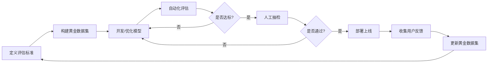

> 无法衡量，就无法改进。在 Agent 时代，评估不是可选项，而是生命线。

在前面的二十六篇文章中，我们从 Transformer 架构一路讲到多 Agent 协作系统，已经掌握了构建复杂 AI 应用的技术栈。但当你真正要把这些技术应用到生产环境时，会遇到一个最棘手的问题：

**你怎么知道你的系统到底好不好用？**

传统的软件工程有单元测试、集成测试、性能测试，代码要么通过，要么失败，标准清晰明确。但大模型（LLM）的输出是概率性的、开放式的、上下文依赖的。同一个问题，模型今天回答得完美无缺，明天可能就会产生幻觉；换个问法，准确率可能从 95% 暴跌到 60%。

这就是 **LLM 评估（LLM Evaluation）** 要解决的核心难题：**如何在一个非确定性、开放式生成的系统中，建立可靠、可重复、可扩展的质量度量体系。**

本篇是 **《AI 技术演进与核心算法实战》第六模块的第一篇**。我们将系统性地拆解 LLM 评估的三大支柱：
1. **黄金数据集（Golden Dataset）**：如何构建高质量的基准测试集。
2. **LLM-as-a-Judge**：如何用大模型本身来评估大模型，实现自动化规模化评估。
3. **Ragas 指标体系**：针对 RAG 系统的多维度评估框架详解。

---

## 1. 为什么传统评估方法失效了？

在深入具体方法之前，我们先看看为什么传统的 NLP 评估指标（如 BLEU、ROUGE、F1 Score）在大模型时代不够用了。

### 1.1 传统指标的局限性

以机器翻译领域的经典指标 **BLEU（Bilingual Evaluation Understudy）** 为例，它通过计算生成文本与参考文本之间的 n-gram 重叠度来打分。

```python
# 伪代码演示 BLEU 的计算逻辑
def calculate_bleu(reference, candidate):
    # 统计候选句子中与参考句子重合的 n-gram 数量
    precision = count_matching_ngrams(candidate, reference) / total_ngrams(candidate)
    # 惩罚过短的句子
    brevity_penalty = min(1, exp(1 - len(reference)/len(candidate)))
    return brevity_penalty * precision
```

**致命缺陷：**
1. **语义等价但字面不同**：如果参考答案是 `"The cat sat on the mat"`，而模型生成的是 `"A feline rested on the rug"`，虽然语义完全一致，但 BLEU 分数会接近于 0，因为没有任何单词重叠。
2. **无法评估逻辑正确性**：对于数学题或代码生成，即使只有一个字符错误（如 `=` 写成 `==`），程序就会崩溃，但 BLEU 可能仍然给出 95% 的高分，因为它只关心词汇匹配，不关心逻辑。
3. **依赖单一参考答案**：现实世界中，一个问题往往有多个正确答案。传统指标要求提供"标准答案"，这在大模型的开放式对话中几乎不可能做到。

### 1.2 LLM 评估的三大挑战

| 挑战维度 | 传统软件评估 | LLM 评估 |
| :--- | :--- | :--- |
| **输出确定性** | 确定性输出（Pass/Fail） | 概率性输出（每次生成都可能不同） |
| **答案唯一性** | 通常有唯一正确答案 | 存在多个语义等价但表述不同的答案 |
| **评估维度** | 功能正确性、性能 | 准确性、相关性、连贯性、安全性、公平性等 |

因此，我们需要一套全新的评估范式，能够理解**语义**而非仅仅匹配**字面**，能够处理**多样性**而非强求**唯一性**，能够评估**多维质量**而非仅看**单一指标**。

---

## 2. 黄金数据集（Golden Dataset）：评估的基石

无论采用何种自动化评估方法，**高质量的基准测试集（Benchmark Dataset）** 都是评估体系的起点。我们称之为**黄金数据集（Golden Dataset）**，因为它像黄金一样珍贵且难以获取。

### 2.1 黄金数据集的核心要素

一个合格的黄金数据集必须包含以下三个部分：

1. **输入（Input / Query）**：用户的问题或任务描述。
2. **预期输出（Expected Output / Ground Truth）**：由人类专家标注的标准答案或参考答案集合。
3. **上下文（Context，可选）**：对于 RAG 系统，还需要提供检索到的相关文档片段。

```json
{
  "id": "qa_001",
  "query": "Python 中列表和元组的主要区别是什么？",
  "context": [
    "Python 有两种常见的序列类型：列表（list）和元组（tuple）。列表是可变的（mutable），可以使用 append()、remove() 等方法修改。元组是不可变的（immutable），一旦创建就不能修改。"
  ],
  "expected_output": "主要区别在于可变性：列表是可变的，可以增删改元素；元组是不可变的，创建后不能修改。此外，元组通常用于存储异构数据，而列表用于存储同质数据。",
  "difficulty": "easy",
  "category": "programming_basics"
}
```

### 2.2 构建黄金数据集的四种策略

#### 策略一：手工标注（Manual Annotation）

这是最传统但也最可靠的方法。由领域专家针对特定场景编写问题和标准答案。

**优点**：质量最高，覆盖边界情况能力强。  
**缺点**：成本极高，速度慢，难以扩展到大规模。

**适用场景**：核心业务场景、高风险领域（如医疗、法律）、需要极高准确率的用例。

#### 策略二：基于现有数据集蒸馏（Distillation from Existing Benchmarks）

利用学术界或工业界已有的公开数据集（如 MMLU、GSM8K、HumanEval），根据你自己的业务需求进行筛选和改编。

```python
# 示例：从 MMLU 数据集中提取计算机科学相关题目
import json

def filter_mmlu_by_category(dataset_path, category="computer_science"):
    with open(dataset_path, 'r') as f:
        data = json.load(f)
    
    filtered = []
    for item in data:
        if item['subject'] == category:
            filtered.append({
                'query': item['question'],
                'choices': item['choices'],
                'expected_output': item['answer']  # A, B, C, or D
            })
    
    return filtered
```

**优点**：快速启动，有学术界的验证背书。  
**缺点**：可能与你的实际业务场景有差距，存在数据泄露风险（模型可能在训练时见过这些数据）。

#### 策略三：LLM 自动生成 + 人工校验（LLM-Generated + Human Review）

这是目前最高效的方法。让强大的 LLM（如 GPT-4）根据你提供的种子问题或文档，自动生成大量的测试用例，然后由人类专家进行抽样审核和修正。

```python
# 伪代码：使用 LLM 生成测试用例
def generate_test_cases(seed_questions, llm_client, num_samples=100):
    prompt = f"""
    基于以下种子问题，生成 {num_samples} 个类似的测试用例。
    每个测试用例应包含：
    1. query: 用户问题
    2. expected_output: 标准答案
    3. difficulty: 难度等级（easy/medium/hard）
    
    种子问题示例：
    {seed_questions[:5]}
    
    请以 JSON 格式输出。
    """
    
    response = llm_client.generate(prompt)
    test_cases = json.loads(response)
    
    return test_cases
```

**工作流程**：
1. 准备 10-20 个高质量的种子问题。
2. 让 LLM 基于这些种子生成 100-500 个变体。
3. 人工抽检 20%-30%，修正错误标注。
4. 迭代优化提示词，重新生成直到满意。

**优点**：速度快，成本低，可以快速覆盖多样化的场景。  
**缺点**：需要严格的人工校验，否则容易引入噪声。

#### 策略四：基于用户反馈的真实数据（Production Data with User Feedback）

从生产环境中收集真实用户的提问，并结合用户的显式反馈（点赞/点踩）或隐式反馈（是否继续追问、会话时长）来构建动态更新的测试集。

**优点**：最贴近真实场景，能发现意想不到的边界案例。  
**缺点**：存在隐私合规风险，反馈信号可能有噪声，需要长时间积累。

### 2.3 黄金数据集的质量控制清单

在将数据集投入评估之前，务必检查以下维度：

- ✅ **多样性（Diversity）**：覆盖不同难度、不同主题、不同问法。
- ✅ **平衡性（Balance）**：各类别样本数量相对均衡，避免偏差。
- ✅ **准确性（Accuracy）**：预期输出经过至少两位专家交叉验证。
- ✅ **时效性（Freshness）**：定期更新，反映最新的业务需求和知识变化。
- ✅ **规模适中（Size）**：小规模快速迭代集（50-100 条）用于日常开发，大规模完整集（500-2000 条）用于版本发布前的全面评估。

---

## 3. LLM-as-a-Judge：用魔法打败魔法

有了黄金数据集，接下来的问题是：**如何高效地对比模型输出与预期输出？**

传统做法是人工逐条审阅，但这在规模化应用中完全不现实。如果一个版本迭代涉及 1000 个测试用例，每个用例需要 3 分钟审阅，那就是 50 小时的人力成本。

于是，**LLM-as-a-Judge** 应运而生：**用一个更强大的 LLM（裁判模型）来评估目标 LLM（被测模型）的输出质量。**

### 3.1 LLM-as-a-Judge 的基本原理

其核心思想非常简单：既然人类可以判断一个回答好不好，那么经过充分训练的 LLM 也应该具备这种判断能力。我们只需要设计合适的**评估提示词（Evaluation Prompt）**，让裁判模型按照既定标准打分。

<div align="center">
  <svg xmlns="http://www.w3.org/2000/svg" viewBox="0 0 700 380" width="100%" height="100%" style="max-width: 700px; margin: 20px 0;" shape-rendering="crispEdges" text-rendering="geometricPrecision">
    <defs>
      <style>
        .bg { fill: #fafafa; }
        .box { fill: #f8fafc; stroke: #3b82f6; stroke-width: 2; rx: 8; ry: 8; }
        .judge-box { fill: #fef08a; stroke: #ca8a04; stroke-width: 3; rx: 12; ry: 12; }
        .text-title { font-family: -apple-system, BlinkMacSystemFont, "Segoe UI", "PingFang SC", "Microsoft YaHei", sans-serif; font-size: 20px; fill: #0f172a; text-anchor: middle; dominant-baseline: middle; font-weight: 700; }
        .text-label { font-family: -apple-system, BlinkMacSystemFont, "Segoe UI", "PingFang SC", "Microsoft YaHei", sans-serif; font-size: 14px; fill: #1e293b; text-anchor: middle; dominant-baseline: middle; }
        .text-desc { font-family: -apple-system, BlinkMacSystemFont, "Segoe UI", "PingFang SC", "Microsoft YaHei", sans-serif; font-size: 12px; fill: #64748b; text-anchor: start; dominant-baseline: middle; }
        .arrow { stroke: #64748b; stroke-width: 2; marker-end: url(#arrowhead); fill: none; }
      </style>
      <marker id="arrowhead" viewBox="0 0 10 10" refX="9" refY="5" markerWidth="6" markerHeight="6" orient="auto">
        <path d="M 0 0 L 10 5 L 0 10 z" fill="#64748b" />
      </marker>
    </defs>
    <!-- Background -->
    <rect width="700" height="380" class="bg"/>
    <!-- Title -->
    <text x="350" y="30" class="text-title">LLM-as-a-Judge 评估流程</text>
    <!-- Input Box -->
    <rect x="30" y="60" width="180" height="100" class="box"/>
    <text x="120" y="85" class="text-label" font-weight="600">输入（Input）</text>
    <text x="40" y="105" class="text-desc">• 用户问题（Query）</text>
    <text x="40" y="125" class="text-desc">• 上下文（Context）</text>
    <text x="40" y="145" class="text-desc">• 预期答案（Ground Truth）</text>
    <!-- Model Output Box -->
    <rect x="260" y="60" width="180" height="100" class="box"/>
    <text x="350" y="85" class="text-label" font-weight="600">被测模型输出</text>
    <text x="270" y="105" class="text-desc">• 生成的回答</text>
    <text x="270" y="125" class="text-desc">• 推理过程（如有）</text>
    <text x="270" y="145" class="text-desc">• 置信度分数</text>
    <!-- Judge LLM Box -->
    <rect x="230" y="210" width="240" height="140" class="judge-box"/>
    <text x="350" y="240" class="text-label" font-weight="700" font-size="16">裁判 LLM（Judge）</text>
    <text x="245" y="270" class="text-desc">评估提示词：</text>
    <text x="245" y="290" class="text-desc">"请根据以下标准评分："</text>
    <text x="245" y="308" class="text-desc">"1. 准确性（0-5分）"</text>
    <text x="245" y="326" class="text-desc">"2. 完整性（0-5分）"</text>
    <text x="245" y="344" class="text-desc">"3. 简洁性（0-5分）"</text>
    <!-- Arrows to Judge -->
    <path d="M 120 160 L 120 280 L 230 280" class="arrow"/>
    <path d="M 350 160 L 350 210" class="arrow"/>
    <!-- Output Score -->
    <rect x="520" y="250" width="150" height="80" class="box" fill="#dcfce3"/>
    <text x="595" y="275" class="text-label" font-weight="600">评估结果</text>
    <text x="530" y="300" class="text-desc">• 综合得分：4.5/5</text>
    <text x="530" y="320" class="text-desc">• 详细评语</text>
    <!-- Arrow from Judge to Output -->
    <path d="M 470 280 L 520 280" class="arrow"/>
  </svg>
</div>

### 3.2 三种常见的评判模式

#### 模式一：单点评分（Pointwise Scoring）

裁判模型独立评估每个回答的质量，给出绝对分数。

```python
evaluation_prompt = """
你是一个专业的 AI 评估专家。请根据以下标准对模型的回答进行评分（1-5分）：

【用户问题】
{query}

【模型回答】
{model_output}

【评估标准】
1. 准确性：回答是否正确，有无事实错误
2. 相关性：是否直接回答了用户问题
3. 清晰度：表达是否清晰易懂

请分别给出三项评分，并说明理由。
格式：{{"accuracy": X, "relevance": Y, "clarity": Z, "reasoning": "..."}}
"""
```

**优点**：简单直观，易于实现。  
**缺点**：不同模型之间的分数可能不可比（裁判模型可能对某些模型有偏见）。

#### 模式二：成对比较（Pairwise Comparison）

裁判模型同时看到两个模型的回答，判断哪个更好。

```python
comparison_prompt = """
你是一个公正的裁判。请比较以下两个模型对同一问题的回答，判断哪个更好。

【用户问题】
{query}

【模型 A 回答】
{output_a}

【模型 B 回答】
{output_b}

请从准确性、完整性、简洁性三个维度进行比较，并给出最终结论：
- 如果 A 更好，输出 "A"
- 如果 B 更好，输出 "B"
- 如果两者相当，输出 "Tie"

同时提供详细的比较分析。
"""
```

**优点**：避免了绝对评分的主观性，更适合模型间的横向对比。  
**缺点**：评估成本高（需要两两组合），可能出现循环偏好（A>B, B>C, C>A）。

#### 模式三：基于参考的答案相似度（Reference-Based Similarity）

裁判模型对比模型输出与黄金标准答案的语义相似度。

```python
similarity_prompt = """
请判断以下模型回答与标准答案在语义上是否一致。

【标准答案】
{ground_truth}

【模型回答】
{model_output}

即使措辞不同，只要核心信息一致即可视为正确。
请输出：
- "correct"：语义一致
- "partially_correct"：部分正确但有遗漏或轻微错误
- "incorrect"：错误或无关

并解释判断依据。
"""
```

**优点**：充分利用黄金数据集，评估结果更可靠。  
**缺点**：依赖于高质量的标准答案，对开放性问题的适用性有限。

### 3.3 实战：构建一个简单的 LLM Judge

下面我们用 Python 和 OpenAI API 实现一个基础的 LLM-as-a-Judge 评估器。

```python
import openai
import json
from typing import Dict, List

class LLMJudge:
    def __init__(self, api_key: str, model: str = "gpt-4-turbo"):
        self.client = openai.OpenAI(api_key=api_key)
        self.model = model
    
    def evaluate_single(self, query: str, output: str, 
                       criteria: List[str] = ["accuracy", "relevance", "clarity"]) -> Dict:
        """单点评分模式"""
        
        prompt = f"""
        你是一个专业的 AI 评估专家。请根据以下标准对模型的回答进行评分（1-5分）：
        
        【用户问题】
        {query}
        
        【模型回答】
        {output}
        
        【评估标准】
        {', '.join(criteria)}
        
        请以 JSON 格式输出评分和理由：
        {{
            "scores": {{"criterion_name": score}},
            "average_score": X.X,
            "reasoning": "详细评价..."
        }}
        """
        
        response = self.client.chat.completions.create(
            model=self.model,
            messages=[{"role": "user", "content": prompt}],
            temperature=0.0  # 降低随机性，保证评估一致性
        )
        
        result = json.loads(response.choices[0].message.content)
        return result
    
    def evaluate_batch(self, test_cases: List[Dict]) -> Dict:
        """批量评估并汇总统计"""
        all_scores = []
        
        for case in test_cases:
            result = self.evaluate_single(
                query=case['query'],
                output=case['model_output']
            )
            all_scores.append(result['average_score'])
        
        return {
            "mean_score": sum(all_scores) / len(all_scores),
            "std_dev": (sum((x - sum(all_scores)/len(all_scores))**2 for x in all_scores) / len(all_scores)) ** 0.5,
            "total_evaluated": len(all_scores)
        }

# 使用示例
if __name__ == "__main__":
    judge = LLMJudge(api_key="your-api-key")
    
    test_case = {
        "query": "解释量子纠缠的概念",
        "model_output": "量子纠缠是指两个或多个粒子之间存在的特殊关联..."
    }
    
    result = judge.evaluate_single(test_case["query"], test_case["model_output"])
    print(json.dumps(result, indent=2, ensure_ascii=False))
```

### 3.4 LLM-as-a-Judge 的潜在陷阱与应对策略

尽管 LLM-as-a-Judge 非常强大，但它并非完美无缺。以下是常见的几个问题及解决方案：

| 问题 | 描述 | 解决方案 |
| :--- | :--- | :--- |
| **位置偏见（Position Bias）** | 在成对比较中，裁判模型倾向于选择先出现的答案 | 随机交换 A/B 顺序，多次评估取平均 |
| **长度偏见（Length Bias）** | 裁判模型倾向于给更长的回答更高分 | 在提示词中明确要求"简洁性与完整性同等重要" |
| **自我偏好（Self-Preference）** | 裁判模型对自己同系列模型的输出打分更高 | 使用第三方中立模型作为裁判（如用 GPT-4 评估 Llama） |
| **评估不一致（Inconsistency）** | 同一回答多次评估得分波动大 | 设置 `temperature=0`，采用多数投票（Majority Voting） |
| **缺乏细粒度反馈** | 只给总分，无法定位具体问题 | 要求裁判模型逐项打分并提供改进建议 |

---

## 4. Ragas：专为 RAG 系统设计的评估框架

前面介绍的 LLM-as-a-Judge 是通用的评估方法，但对于 **RAG（Retrieval-Augmented Generation，检索增强生成）** 系统，我们需要更精细化的评估指标。

RAG 系统有两个核心组件：**检索器（Retriever）** 和 **生成器（Generator）**。任何一个环节出问题都会导致最终答案质量下降。因此，我们需要分别评估这两个组件，以及它们的协同效果。

这就是 **Ragas** 框架诞生的背景。Ragas 是一个开源的 Python 库，提供了一套专门针对 RAG 系统的多维度评估指标。

### 4.1 Ragas 的核心指标体系

Ragas 定义了以下关键指标，覆盖了 RAG 系统的各个环节：

<div align="center">
  <svg xmlns="http://www.w3.org/2000/svg" viewBox="0 0 750 450" width="100%" height="100%" style="max-width: 750px; margin: 20px 0;" shape-rendering="crispEdges" text-rendering="geometricPrecision">
    <defs>
      <style>
        .bg { fill: #fafafa; }
        .layer-box { fill: #f8fafc; stroke: #3b82f6; stroke-width: 2; rx: 10; ry: 10; }
        .metric-box { fill: #ffffff; stroke: #94a3b8; stroke-width: 2; rx: 6; ry: 6; }
        .text-title { font-family: -apple-system, BlinkMacSystemFont, "Segoe UI", "PingFang SC", "Microsoft YaHei", sans-serif; font-size: 22px; fill: #0f172a; text-anchor: middle; dominant-baseline: middle; font-weight: 700; }
        .text-layer { font-family: -apple-system, BlinkMacSystemFont, "Segoe UI", "PingFang SC", "Microsoft YaHei", sans-serif; font-size: 16px; fill: #1e40af; text-anchor: middle; dominant-baseline: middle; font-weight: 600; }
        .text-metric { font-family: -apple-system, BlinkMacSystemFont, "Segoe UI", "PingFang SC", "Microsoft YaHei", sans-serif; font-size: 13px; fill: #1e293b; text-anchor: middle; dominant-baseline: middle; }
        .text-formula { font-family: "Courier New", monospace; font-size: 11px; fill: #64748b; text-anchor: middle; dominant-baseline: middle; }
        .arrow { stroke: #64748b; stroke-width: 2; marker-end: url(#arrowhead); fill: none; }
      </style>
      <marker id="arrowhead" viewBox="0 0 10 10" refX="9" refY="5" markerWidth="6" markerHeight="6" orient="auto">
        <path d="M 0 0 L 10 5 L 0 10 z" fill="#64748b" />
      </marker>
    </defs>
    <!-- Background -->
    <rect width="750" height="450" class="bg"/>
    <!-- Title -->
    <text x="375" y="30" class="text-title">Ragas RAG 评估指标体系</text>
    <!-- Retrieval Layer -->
    <rect x="30" y="55" width="690" height="120" class="layer-box" fill="#dbeafe"/>
    <text x="375" y="80" class="text-layer">检索层评估（Retrieval Metrics）</text>
    <!-- Context Precision -->
    <rect x="60" y="100" width="200" height="60" class="metric-box"/>
    <text x="160" y="120" class="text-metric" font-weight="600">上下文精确率</text>
    <text x="160" y="140" class="text-formula">Context Precision</text>
    <!-- Context Recall -->
    <rect x="290" y="100" width="200" height="60" class="metric-box"/>
    <text x="390" y="120" class="text-metric" font-weight="600">上下文召回率</text>
    <text x="390" y="140" class="text-formula">Context Recall</text>
    <!-- Context Relevancy -->
    <rect x="520" y="100" width="200" height="60" class="metric-box"/>
    <text x="620" y="120" class="text-metric" font-weight="600">上下文相关性</text>
    <text x="620" y="140" class="text-formula">Context Relevancy</text>
    <!-- Arrow down -->
    <path d="M 375 175 L 375 205" class="arrow"/>
    <!-- Generation Layer -->
    <rect x="30" y="205" width="690" height="120" class="layer-box" fill="#bbf7d0"/>
    <text x="375" y="230" class="text-layer" fill="#15803d">生成层评估（Generation Metrics）</text>
    <!-- Faithfulness -->
    <rect x="60" y="250" width="200" height="60" class="metric-box"/>
    <text x="160" y="270" class="text-metric" font-weight="600">忠实度</text>
    <text x="160" y="290" class="text-formula">Faithfulness</text>
    <!-- Answer Relevance -->
    <rect x="290" y="250" width="200" height="60" class="metric-box"/>
    <text x="390" y="270" class="text-metric" font-weight="600">答案相关性</text>
    <text x="390" y="290" class="text-formula">Answer Relevancy</text>
    <!-- Answer Correctness -->
    <rect x="520" y="250" width="200" height="60" class="metric-box"/>
    <text x="620" y="270" class="text-metric" font-weight="600">答案正确性</text>
    <text x="620" y="290" class="text-formula">Answer Correctness</text>
    <!-- Arrow down -->
    <path d="M 375 325 L 375 355" class="arrow"/>
    <!-- Overall Quality -->
    <rect x="200" y="355" width="350" height="70" class="layer-box" fill="#fef08a"/>
    <text x="375" y="380" class="text-layer" fill="#a16207">综合质量评估</text>
    <text x="375" y="405" class="text-formula" font-size="12">加权平均各指标得分，形成 RAG 系统整体评分</text>
  </svg>
</div>

#### 4.1.1 检索层指标

**① 上下文精确率（Context Precision）**

衡量检索到的文档中，有多少是与问题真正相关的。

$$
\text{Context Precision} = \frac{\text{相关文档数量}}{\text{检索到的总文档数量}}
$$

**理想值**：越接近 1 越好，表示检索器没有返回噪声文档。

**② 上下文召回率（Context Recall）**

衡量所有应该被检索到的相关文档中，有多少被成功检索到了。

$$
\text{Context Recall} = \frac{\text{检索到的相关文档数量}}{\text{所有相关文档总数}}
$$

**理想值**：越接近 1 越好，表示检索器没有遗漏重要信息。

**③ 上下文相关性（Context Relevancy）**

评估检索到的文档与用户问题的语义相关程度（由 LLM 判断）。

```python
# Ragas 内部使用的评估提示词示例
prompt = """
给定问题和检索到的上下文，判断上下文是否与问题相关。

问题：{question}
上下文：{context}

请输出分数（0-1），其中 1 表示完全相关，0 表示完全无关。
"""
```

#### 4.1.2 生成层指标

**④ 忠实度（Faithfulness）**

衡量生成的答案是否完全基于检索到的上下文，有没有"编造"信息（即幻觉）。

$$
\text{Faithfulness} = \frac{\text{答案中可从上下文推断的声明数量}}{\text{答案中的总声明数量}}
$$

**计算方法**：
1. 从答案中提取所有事实性声明（Claims）。
2. 逐一验证每个声明是否能从上下文中找到依据。
3. 计算可验证声明的比例。

**示例**：
- 上下文：`"Python 由 Guido van Rossum 于 1991 年发布。"`
- 答案：`"Python 由 Guido van Rossum 在 1991 年创建，是一种高级编程语言。"`
- 分析：
  - 声明 1："Python 由 Guido van Rossum 创建" ✓ 可从上下文推断
  - 声明 2："Python 于 1991 年发布" ✓ 可从上下文推断
  - 声明 3："Python 是高级编程语言" ✗ 上下文中未提及
- 忠实度 = 2/3 ≈ 0.67

**⑤ 答案相关性（Answer Relevancy）**

衡量生成的答案是否直接回答了用户的问题，有没有跑题或冗余。

**评估方式**：由 LLM 判断答案与问题的语义匹配度。

```python
relevance_prompt = """
问题：{question}
答案：{answer}

这个答案是否直接、完整地回答了问题？
评分标准：
- 1.0：完美回答，无冗余
- 0.7：基本回答，但有少量无关信息
- 0.4：部分回答，遗漏关键点
- 0.0：完全无关或错误

请给出分数和理由。
"""
```

**⑥ 答案正确性（Answer Correctness）**

在有标准答案（Ground Truth）的情况下，直接对比生成答案与标准答案的语义一致性。

**计算方法**：
- 使用嵌入模型（Embedding Model）计算答案向量的余弦相似度。
- 或者使用 LLM 进行语义等价判断。

### 4.2 实战：使用 Ragas 评估 RAG 系统

下面是一个完整的 Ragas 评估示例。

```python
from ragas import evaluate
from ragas.metrics import (
    faithfulness,
    answer_relevancy,
    context_precision,
    context_recall,
    answer_correctness
)
from datasets import Dataset

# 1. 准备评估数据
data_samples = {
    'question': [
        'Python 中列表和元组的区别是什么？',
        '什么是机器学习？',
        '解释 Transformer 架构的核心思想'
    ],
    'answer': [
        '列表是可变的，元组是不可变的。列表用方括号 []，元组用圆括号 ()。',
        '机器学习是让计算机从数据中学习规律的技术，包括监督学习、无监督学习和强化学习。',
        'Transformer 基于自注意力机制，能够并行处理序列数据，解决了 RNN 的长距离依赖问题。'
    ],
    'contexts': [
        ['Python 有两种序列类型：列表（list）和元组（tuple）。列表是可变的（mutable），可以使用 append() 修改。元组是不可变的（immutable），创建后不能修改。'],
        ['机器学习是人工智能的一个子集，通过算法让计算机从数据中学习模式。主要类型包括监督学习（有标签数据）、无监督学习（无标签数据）和强化学习（通过与环境交互学习）。'],
        ['Transformer 架构由 Vaswani 等人在 2017 年提出，核心是自注意力机制（Self-Attention）。它允许模型在处理每个词时关注序列中的所有其他词，实现了真正的并行计算。']
    ],
    'ground_truth': [
        '主要区别在于可变性：列表可以修改，元组不能。列表用 []，元组用 ()。',
        '机器学习是 AI 的子领域，通过数据训练模型，分为监督、无监督和强化学习。',
        'Transformer 使用自注意力机制替代 RNN，实现并行处理和更好的长距离依赖建模。'
    ]
}

# 2. 转换为 Ragas 所需的 Dataset 格式
dataset = Dataset.from_dict(data_samples)

# 3. 执行评估
result = evaluate(
    dataset,
    metrics=[
        faithfulness,          # 忠实度
        answer_relevancy,      # 答案相关性
        context_precision,     # 上下文精确率
        context_recall,        # 上下文召回率
        answer_correctness     # 答案正确性
    ]
)

# 4. 查看结果
print(result)
```

**输出示例**：
```
{'faithfulness': 0.89, 
 'answer_relevancy': 0.92, 
 'context_precision': 0.85, 
 'context_recall': 0.78, 
 'answer_correctness': 0.87}
```

### 4.3 Ragas 的优势与局限

**优势**：
- ✅ **端到端评估**：同时覆盖检索和生成两个环节。
- ✅ **无需人工标注**：大部分指标可通过 LLM 自动计算。
- ✅ **细粒度诊断**：能定位问题是出在检索器还是生成器。
- ✅ **开源社区支持**：持续更新，集成主流 LLM 和向量数据库。

**局限**：
- ⚠️ **依赖 LLM 裁判**：继承了 LLM-as-a-Judge 的所有偏见问题。
- ⚠️ **计算成本高**：每个样本需要多次调用 LLM，评估大规模数据集时费用昂贵。
- ⚠️ **对复杂推理任务支持有限**：目前主要针对事实性问答，对代码生成、创意写作等场景的评估仍在完善中。

---

## 5. 构建完整的 LLM 评估流水线

在实际工程中，我们不会孤立地使用某一种评估方法，而是将它们组合成一个**多层级的评估流水线（Evaluation Pipeline）**。

### 5.1 三层评估架构

<div align="center">
  <svg xmlns="http://www.w3.org/2000/svg" viewBox="0 0 700 400" width="100%" height="100%" style="max-width: 700px; margin: 20px 0;" shape-rendering="crispEdges" text-rendering="geometricPrecision">
    <defs>
      <style>
        .bg { fill: #fafafa; }
        .layer { fill: #f8fafc; stroke: #3b82f6; stroke-width: 2; rx: 10; ry: 10; }
        .text-title { font-family: -apple-system, BlinkMacSystemFont, "Segoe UI", "PingFang SC", "Microsoft YaHei", sans-serif; font-size: 20px; fill: #0f172a; text-anchor: middle; dominant-baseline: middle; font-weight: 700; }
        .text-layer { font-family: -apple-system, BlinkMacSystemFont, "Segoe UI", "PingFang SC", "Microsoft YaHei", sans-serif; font-size: 16px; fill: #1e40af; text-anchor: middle; dominant-baseline: middle; font-weight: 600; }
        .text-item { font-family: -apple-system, BlinkMacSystemFont, "Segoe UI", "PingFang SC", "Microsoft YaHei", sans-serif; font-size: 13px; fill: #334155; text-anchor: start; dominant-baseline: middle; }
        .arrow { stroke: #64748b; stroke-width: 2; marker-end: url(#arrowhead); fill: none; }
      </style>
      <marker id="arrowhead" viewBox="0 0 10 10" refX="9" refY="5" markerWidth="6" markerHeight="6" orient="auto">
        <path d="M 0 0 L 10 5 L 0 10 z" fill="#64748b" />
      </marker>
    </defs>
    <!-- Background -->
    <rect width="700" height="400" class="bg"/>
    <!-- Title -->
    <text x="350" y="30" class="text-title">三层 LLM 评估流水线</text>
    <!-- Layer 1: Unit Tests -->
    <rect x="50" y="55" width="600" height="90" class="layer" fill="#dbeafe"/>
    <text x="350" y="80" class="text-layer">第一层：单元测试（Unit Tests）</text>
    <text x="70" y="105" class="text-item">• 确定性规则检查（正则表达式、关键词匹配）</text>
    <text x="70" y="125" class="text-item">• 格式验证（JSON Schema、输出结构）</text>
    <text x="70" y="145" class="text-item">• 安全过滤（敏感词、PII 检测）</text>
    <!-- Arrow -->
    <path d="M 350 145 L 350 170" class="arrow"/>
    <!-- Layer 2: Automated Eval -->
    <rect x="50" y="170" width="600" height="110" class="layer" fill="#fef08a"/>
    <text x="350" y="195" class="text-layer" fill="#a16207">第二层：自动化评估（Automated Evaluation）</text>
    <text x="70" y="220" class="text-item">• LLM-as-a-Judge 批量评分</text>
    <text x="70" y="240" class="text-item">• Ragas 指标计算（针对 RAG 系统）</text>
    <text x="70" y="260" class="text-item">• 回归测试（与基线版本对比）</text>
    <!-- Arrow -->
    <path d="M 350 280 L 350 305" class="arrow"/>
    <!-- Layer 3: Human Review -->
    <rect x="50" y="305" width="600" height="80" class="layer" fill="#bbf7d0"/>
    <text x="350" y="330" class="text-layer" fill="#15803d">第三层：人工抽检（Human Review）</text>
    <text x="70" y="355" class="text-item">• 低分案例深度分析</text>
    <text x="70" y="375" class="text-item">• 边界案例与异常行为审计</text>
  </svg>
</div>

#### 第一层：单元测试（快速反馈）

这一层的目标是**快速拦截明显的错误**，类似于传统软件的单元测试。

```python
def unit_test_output_format(output: str) -> bool:
    """检查输出是否符合预期的 JSON 格式"""
    try:
        json.loads(output)
        return True
    except json.JSONDecodeError:
        return False

def unit_test_safety_filter(output: str) -> bool:
    """检查输出是否包含敏感内容"""
    sensitive_keywords = ["密码", "身份证号", "银行卡"]
    return not any(keyword in output for keyword in sensitive_keywords)

def unit_test_length_constraint(output: str, max_length: int = 500) -> bool:
    """检查输出长度是否在合理范围内"""
    return len(output) <= max_length
```

**特点**：
- 执行速度快（毫秒级）
- 100% 确定性
- 适用于 CI/CD 流水线中的每次代码提交

#### 第二层：自动化评估（规模化质量监控）

这一层使用 LLM-as-a-Judge 和 Ragas 等工具，对黄金数据集进行批量评估。

```python
def automated_evaluation_pipeline(model_version: str):
    """自动化评估流水线"""
    # 1. 加载黄金数据集
    test_cases = load_golden_dataset("production_v1.json")
    
    # 2. 运行模型生成答案
    results = []
    for case in test_cases:
        output = call_llm(case['query'], model=model_version)
        results.append({
            **case,
            'model_output': output
        })
    
    # 3. 使用 Ragas 评估
    ragas_scores = evaluate_with_ragas(results)
    
    # 4. 使用 LLM Judge 评估
    judge_scores = evaluate_with_llm_judge(results)
    
    # 5. 汇总报告
    report = {
        'model_version': model_version,
        'ragas_metrics': ragas_scores,
        'judge_metrics': judge_scores,
        'timestamp': datetime.now().isoformat()
    }
    
    save_evaluation_report(report)
    return report
```

**特点**：
- 执行速度中等（分钟到小时级，取决于数据集大小）
- 覆盖语义层面的质量评估
- 适用于每日夜间批处理或版本发布前的回归测试

#### 第三层：人工抽检（最终质量把关）

这一层由人类专家对自动化评估中发现的低分案例、边界案例进行深度审查。

**抽检策略**：
- **随机抽样**：从每个类别中随机抽取 5%-10% 的案例。
- **重点审查**：优先审查自动化评分低于阈值的案例。
- **对抗测试**：故意构造困难样本（如歧义问题、对抗性提示），测试模型的鲁棒性。

**特点**：
- 执行速度慢（人力成本高）
- 评估质量最高，能发现自动化评估遗漏的问题
- 适用于重大版本发布前的最终验收

### 5.2 评估驱动的开发流程（Evaluation-Driven Development）

借鉴测试驱动开发（TDD）的理念，我们可以建立**评估驱动开发（EDD）** 的工作流：



**核心原则**：
1. **先定义评估标准，再开始开发**：明确什么样的输出才算"好"。
2. **评估先行**：在优化模型之前，先运行基线评估，建立性能基准。
3. **持续迭代**：每次模型改动后，自动运行评估流水线，确保没有退化（Regression）。
4. **数据飞轮**：将生产环境的用户反馈不断补充到黄金数据集中，形成闭环。

---

## 6. 评估实践中的常见陷阱与最佳实践

### 6.1 常见陷阱

| 陷阱 | 描述 | 后果 |
| :--- | :--- | :--- |
| **评估集污染（Data Leakage）** | 测试数据出现在训练集中 | 评估结果虚高，无法反映真实性能 |
| **指标单一化** | 只关注准确率，忽视其他维度 | 模型可能在某些场景下表现极差 |
| **过度依赖自动化** | 完全信任 LLM Judge，不做人工校验 | 忽略裁判模型的偏见和错误 |
| **静态评估集** | 长期使用同一套测试数据 | 模型过拟合测试集，泛化能力下降 |
| **忽略延迟与成本** | 只评估质量，不考虑推理速度和 Token 消耗 | 线上部署后成本失控 |

### 6.2 最佳实践清单

✅ **多样化评估集**：确保测试数据覆盖不同难度、主题、语言风格。  
✅ **多指标综合评估**：不要只看一个分数，要结合准确性、相关性、忠实度等多个维度。  
✅ **定期更新黄金数据集**：每季度至少更新 20%-30% 的测试用例，保持时效性。  
✅ **人工校验自动化结果**：抽样检查 LLM Judge 的评分，校准其偏见。  
✅ **建立评估看板（Dashboard）**：可视化追踪各项指标的历史趋势，及时发现退化。  
✅ **A/B 测试验证**：在线上环境中对小流量用户进行 A/B 测试，验证实战效果。  
✅ **文档化评估流程**：记录评估方法、数据集版本、评分标准，保证可复现性。

---

## 结语

> 评估不是为了证明模型有多好，而是为了发现它哪里还不够好。

在本篇中，我们系统地探讨了 LLM 评估的三大支柱：
1. **黄金数据集**：评估的基石，需要精心构建和维护。
2. **LLM-as-a-Judge**：用大模型评估大模型，实现规模化自动化。
3. **Ragas 指标体系**：专为 RAG 系统设计的多维度评估框架。

我们还介绍了如何将这些方法组合成一个**三层评估流水线**，并将其融入到**评估驱动开发（EDD）** 的工作流中。

记住，**没有完美的评估体系，只有不断迭代的评估流程**。随着你的应用场景越来越复杂，评估体系也需要随之进化。

下一篇，我们将进入可观测性领域，探讨如何搭建**全链路追踪（Trace）、延迟分析与成本监控面板**，让你的 LLM 应用在生产环境中透明可控。敬请期待《可观测性架构：全链路追踪、延迟分析与成本监控面板搭建》。

---

## 📚 参考文献与延伸阅读

1. **Judging LLM-as-a-Judge with MT-Bench and Chatbot Arena** (Zheng et al., 2023) - 系统性研究 LLM-as-a-Judge 的有效性和局限性，提出了 MT-Bench 基准测试。
2. **Ragas: Framework for Evaluating RAG Pipelines** (Shahul et al., 2023) - Ragas 框架的官方论文，详细介绍了各评估指标的设计原理。
3. **Beyond Accuracy: Behavioral Testing of NLP Models with CheckList** (Ribeiro et al., 2020) - 提出了超越单一准确率的多维度行为测试方法。
4. **Holistic Evaluation of Language Models (HELM)** (Liang et al., 2022) - Stanford 提出的全面评估语言模型的框架，覆盖准确性、鲁棒性、公平性等 7 个维度。
5. **OpenAI Evals** - OpenAI 开源的评估框架，提供了构建自定义评估任务的工具和最佳实践。
6. **LangSmith Tracing & Evaluation** - LangChain 官方的评估与追踪平台，集成了 LLM-as-a-Judge 和 Ragas 指标。

---
> **下一篇预告：** [可观测性架构：全链路追踪、延迟分析与成本监控面板搭建](#)
