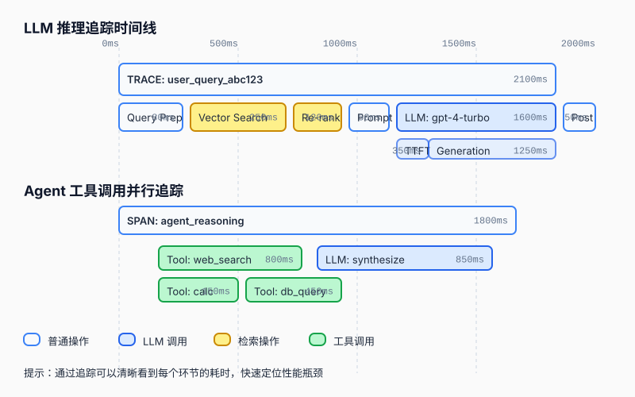
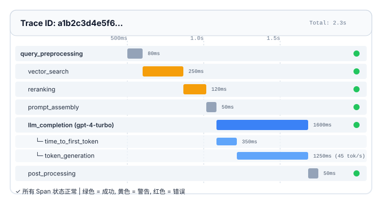
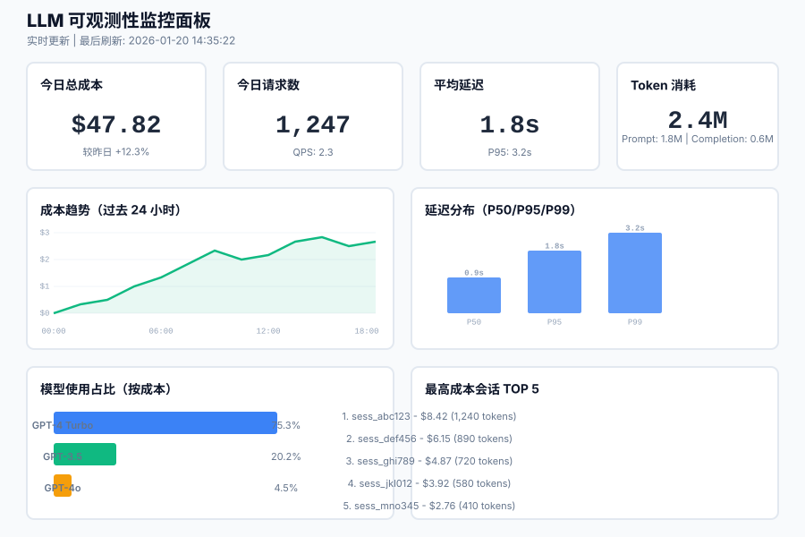

> 不可观测的系统，就像在黑盒中飞行。你只知道它还在运行，却不知道它何时会坠毁。

在上一篇中，我们探讨了如何通过评估体系来衡量 LLM 应用的质量。但评估只是故事的一半——它告诉你模型**应该**表现得有多好。而**可观测性（Observability）** 则告诉你模型**实际**表现得怎么样。

想象一下这个场景：你的 RAG 聊天机器人上线一周后，用户突然抱怨响应变慢了。是检索器出了问题？还是 LLM API 延迟增加了？或者是向量数据库的查询效率下降了？如果没有完善的可观测性系统，你只能靠猜。

更糟糕的是，LLM 应用的成本结构与传统软件完全不同。传统软件的成本主要是服务器和带宽，而 LLM 应用的成本主要由 **Token 消耗**决定。一次看似普通的对话，可能因为模型选择了错误的推理路径，导致 Token 消耗暴增 10 倍，而你直到月底看到账单时才会发现。

这就是本篇要解决的核心问题：**如何构建一个全方位的可观测性架构，让你能够实时追踪 LLM 应用的每一个环节，快速定位性能瓶颈，精确控制成本支出。**

本篇是 **《AI 技术演进与核心算法实战》第六模块的第二篇**。我们将深入探讨：
1. **可观测性的三大支柱**：Logs、Metrics、Traces 在 LLM 系统中的特殊含义。
2. **全链路追踪（Distributed Tracing）**：如何用 OpenTelemetry 追踪从用户请求到最终响应的完整路径。
3. **延迟分解与分析**：识别检索、生成、后处理各环节的性能瓶颈。
4. **成本监控与预警**：实时统计 Token 消耗，建立多层级的成本告警机制。
5. **实战：搭建完整的监控面板**：使用 LangSmith、Prometheus + Grafana 构建生产级可观测性系统。

---

## 1. 为什么 LLM 应用需要特殊的可观测性方案？

### 1.1 传统可观测性的局限

在传统微服务架构中，可观测性主要关注三个维度：
- **日志（Logs）**：记录系统发生的事件。
- **指标（Metrics）**：聚合的数值数据（如 QPS、CPU 使用率）。
- **追踪（Traces）**：请求在多个服务间的流转路径。

这套体系对于确定性系统非常有效。但对于 LLM 应用，它存在以下不足：

| 传统可观测性 | LLM 可观测性需求 | 差距 |
| :--- | :--- | :--- |
| 记录 HTTP 请求/响应 | 需要记录 Prompt、Completion、Token 数量 | 缺少语义层面的信息 |
| 追踪服务间调用链 | 需要追踪 LLM 内部的推理步骤（如 Chain-of-Thought） | 缺少模型内部状态的可见性 |
| 监控 API 延迟 | 需要分解为检索延迟、生成延迟、后处理延迟 | 缺少细粒度的延迟归因 |
| 统计服务器成本 | 需要统计每个会话、每个用户的 Token 成本 | 缺少业务维度的成本分摊 |

### 1.2 LLM 应用的独特挑战

#### 挑战一：非确定性输出

同一个 Prompt，每次调用可能产生不同的输出。这意味着你不能简单地通过"预期输出 vs 实际输出"来判断系统是否正常。你需要追踪的是**输出质量的分布**，而不是单次调用的对错。

#### 挑战二：长链路依赖

一个典型的 RAG 请求可能涉及以下步骤：
1. 用户输入预处理（清洗、分词）
2. 查询改写（Query Rewriting）
3. 向量检索（Vector Search）
4. 重排序（Re-Ranking）
5. Prompt 组装
6. LLM 生成
7. 后处理（格式化、过滤）
8. 缓存检查

其中任何一个环节出问题，都会影响最终结果。传统的 APM（Application Performance Monitoring）工具只能告诉你"某个 API 慢了"，但无法告诉你**是哪一步慢了，以及为什么慢**。

#### 挑战三：成本不可控

LLM API 的计费模式是按 Token 数量收费。一个复杂的 Agent 系统可能会进行多轮推理、多次工具调用，导致单次用户请求的 Token 消耗从几百到几万不等。如果没有实时监控，很容易出现"成本爆炸"。

#### 挑战四：幻觉难以检测

模型可能生成看似合理但实际错误的内容。这种"隐性失败"不会触发传统的错误告警（因为 HTTP 状态码是 200），但却会严重损害用户体验。

---

## 2. LLM 可观测性的三大支柱

为了应对上述挑战，我们需要重新定义可观测性的三大支柱在 LLM 语境下的含义。

### 2.1 Logs：从事件日志到语义日志

在传统系统中，日志记录的是技术事件（如"数据库连接成功"）。在 LLM 系统中，日志需要记录**语义事件**：

```python
# 传统日志
logger.info("POST /api/chat completed in 2.3s")

# LLM 语义日志
logger.info({
    "event": "llm_completion",
    "model": "gpt-4-turbo",
    "prompt_tokens": 1250,
    "completion_tokens": 380,
    "total_cost_usd": 0.0152,
    "temperature": 0.7,
    "finish_reason": "stop",
    "latency_ms": 2300,
    "user_id": "usr_12345",
    "session_id": "sess_67890"
})
```

**关键日志类型**：
- **Prompt/Completion 日志**：记录完整的输入输出（注意脱敏）。
- **Token 消耗日志**：详细记录每个环节的 Token 使用情况。
- **工具调用日志**：记录 Agent 调用了哪些工具、参数是什么、返回结果如何。
- **中间推理步骤日志**：对于 Chain-of-Thought，记录每一步的思考过程。

### 2.2 Metrics：从技术指标到业务指标

除了传统的 CPU、内存、QPS 等技术指标，LLM 系统需要监控以下业务指标：

**质量指标**：
- 平均响应质量评分（由 LLM-as-a-Judge 实时计算）
- 幻觉率（通过事实核查工具检测）
- 用户满意度（点赞/点踩比例）

**性能指标**：
- P50/P95/P99 延迟
- 首字延迟（Time to First Token, TTFT）
- Token 生成速度（Tokens per Second）

**成本指标**：
- 每小时/每日 Token 消耗总量
- 平均每会话成本
- 各模型的成本占比

### 2.3 Traces：从服务追踪到推理追踪

这是 LLM 可观测性的核心创新点。传统的分布式追踪关注服务间的调用关系，而 **LLM 追踪（LLM Tracing）** 关注的是**推理过程的完整性**。



**LLM 追踪的关键要素**：
- **Span 层级结构**：根 Span 代表整个用户请求，子 Span 代表各个处理步骤。
- **元数据丰富性**：每个 Span 需要携带丰富的元数据（模型名称、Token 数量、温度参数等）。
- **流式输出支持**：对于流式响应，需要记录首字延迟（TTFT）和后续 Token 的生成速率。
- **并行调用可视化**：Agent 系统中的多个工具调用可能是并行的，追踪系统需要正确展示这种并发关系。

---

## 3. 全链路追踪实战：基于 OpenTelemetry

### 3.1 OpenTelemetry 简介

**OpenTelemetry（OTel）** 是一个开源的可观测性框架，提供了统一的 API 和 SDK 来收集 Traces、Metrics 和 Logs。它的最大优势是**厂商中立**——你可以将数据发送到任何后端（如 Jaeger、Zipkin、Datadog、LangSmith 等）。

对于 LLM 应用，OpenTelemetry 提供了专门的 **Semantic Conventions for GenAI**，定义了如何标准化地记录 LLM 相关的属性。

### 3.2 安装与配置

首先，安装必要的依赖：

```bash
pip install opentelemetry-api \
            opentelemetry-sdk \
            opentelemetry-instrumentation-openai \
            opentelemetry-exporter-otlp
```

然后，初始化 Tracer：

```python
from opentelemetry import trace
from opentelemetry.sdk.trace import TracerProvider
from opentelemetry.sdk.trace.export import BatchSpanProcessor
from opentelemetry.exporter.otlp.proto.grpc.trace_exporter import OTLPSpanExporter
from opentelemetry.instrumentation.openai import OpenAIInstrumentor

# 1. 创建 TracerProvider
provider = TracerProvider()

# 2. 配置导出器（发送到 Jaeger 或 LangSmith）
otlp_exporter = OTLPSpanExporter(
    endpoint="http://localhost:4317",  # OTLP Collector 地址
    insecure=True
)
processor = BatchSpanProcessor(otlp_exporter)
provider.add_span_processor(processor)

# 3. 设置为全局 TracerProvider
trace.set_tracer_provider(provider)

# 4. 自动 Instrument OpenAI SDK
OpenAIInstrumentor().instrument()

# 5. 获取 Tracer
tracer = trace.get_tracer(__name__)
```

### 3.3 手动添加自定义 Span

虽然 OpenAIInstrumentor 会自动追踪 OpenAI API 调用，但对于自定义逻辑（如检索、后处理），我们需要手动创建 Span：

```python
import time
from opentelemetry import trace

tracer = trace.get_tracer(__name__)

def rag_pipeline(user_query: str):
    # 创建根 Span
    with tracer.start_as_current_span("rag_pipeline") as root_span:
        root_span.set_attribute("user.query", user_query)
        root_span.set_attribute("user.id", "usr_12345")
        
        # Step 1: 查询改写
        with tracer.start_as_current_span("query_rewriting") as span:
            rewritten_query = rewrite_query(user_query)
            span.set_attribute("input.query", user_query)
            span.set_attribute("output.rewritten_query", rewritten_query)
        
        # Step 2: 向量检索
        with tracer.start_as_current_span("vector_search") as span:
            start_time = time.time()
            documents = vector_db.search(rewritten_query, top_k=5)
            latency_ms = (time.time() - start_time) * 1000
            
            span.set_attribute("db.system", "chromadb")
            span.set_attribute("db.operation", "search")
            span.set_attribute("db.result_count", len(documents))
            span.set_attribute("performance.latency_ms", latency_ms)
        
        # Step 3: 重排序
        with tracer.start_as_current_span("reranking") as span:
            ranked_docs = reranker.rank(rewritten_query, documents)
            span.set_attribute("reranker.model", "cross-encoder-ms-marco")
            span.set_attribute("reranker.input_count", len(documents))
            span.set_attribute("reranker.output_count", len(ranked_docs))
        
        # Step 4: Prompt 组装
        with tracer.start_as_current_span("prompt_assembly") as span:
            prompt = build_prompt(rewritten_query, ranked_docs)
            span.set_attribute("llm.prompt.length", len(prompt))
        
        # Step 5: LLM 生成（会被 OpenAIInstrumentor 自动追踪）
        response = openai_client.chat.completions.create(
            model="gpt-4-turbo",
            messages=[{"role": "user", "content": prompt}],
            temperature=0.7
        )
        
        # Step 6: 后处理
        with tracer.start_as_current_span("post_processing") as span:
            final_answer = format_response(response.choices[0].message.content)
            span.set_attribute("output.formatted", True)
        
        root_span.set_attribute("output.answer", final_answer)
        return final_answer
```

### 3.4 查看追踪结果

将数据发送到 Jaeger 后，你可以在 Web UI 中看到完整的追踪链路：



**关键观察点**：
- **瓶颈识别**：从图中可以清楚看到，LLM 生成占据了 70% 的时间（1600ms / 2300ms）。
- **TTFT 分析**：首字延迟为 350ms，如果这个值过高，会影响用户的感知体验。
- **生成速率**：Token 生成速率为 45 tokens/s，可以用来评估是否需要切换到更快的模型。

---

## 4. 延迟分解与性能优化

### 4.1 延迟的组成

一个典型的 RAG 请求的延迟可以分解为以下几个部分：

$$
T_{total} = T_{preprocess} + T_{retrieval} + T_{rerank} + T_{prompt} + T_{LLM} + T_{postprocess}
$$

其中：
- $T_{preprocess}$：查询预处理（清洗、分词、改写）
- $T_{retrieval}$：向量检索（包括网络往返和数据库查询）
- $T_{rerank}$：重排序模型推理
- $T_{prompt}$：Prompt 组装（字符串拼接、模板渲染）
- $T_{LLM}$：LLM API 调用（包括网络延迟和模型推理）
- $T_{postprocess}$：后处理（格式化、过滤、缓存写入）

### 4.2 延迟基准参考

以下是各个环节的典型延迟范围（供参考）：

| 环节 | 典型延迟 | 优化目标 |
| :--- | :--- | :--- |
| 查询预处理 | 10-50ms | < 30ms |
| 向量检索（本地） | 50-200ms | < 100ms |
| 向量检索（远程） | 100-500ms | < 200ms |
| 重排序 | 50-300ms | < 150ms |
| Prompt 组装 | 5-20ms | < 10ms |
| LLM TTFT | 200-800ms | < 400ms |
| LLM 生成速率 | 20-100 tokens/s | > 50 tokens/s |
| 后处理 | 5-30ms | < 15ms |

### 4.3 性能优化策略

#### 策略一：并行化检索与重排序

如果重排序模型不依赖于检索结果的顺序，可以将两者并行执行：

```python
import asyncio

async def parallel_retrieval(query: str):
    # 并行执行向量检索和关键词检索
    vector_results, bm25_results = await asyncio.gather(
        vector_db.search(query, top_k=10),
        bm25_engine.search(query, top_k=10)
    )
    
    # 合并结果后再重排序
    merged_docs = merge_results(vector_results, bm25_results)
    ranked_docs = reranker.rank(query, merged_docs)
    
    return ranked_docs[:5]
```

#### 策略二：流式输出降低感知延迟

对于 LLM 生成，使用流式输出可以让用户在第一个 Token 生成后立即看到响应，而不是等待全部内容生成完毕：

```python
async def stream_response(prompt: str):
    start_time = time.time()
    
    async for chunk in openai_client.chat.completions.create(
        model="gpt-4-turbo",
        messages=[{"role": "user", "content": prompt}],
        stream=True
    ):
        if chunk.choices[0].delta.content:
            # 记录首字延迟
            if not first_token_recorded:
                ttft_ms = (time.time() - start_time) * 1000
                logger.info(f"TTFT: {ttft_ms:.0f}ms")
                first_token_recorded = True
            
            yield chunk.choices[0].delta.content
```

#### 策略三：缓存高频查询

对于重复的用户查询，可以直接从缓存中返回结果，避免昂贵的 LLM 调用：

```python
from redis import Redis
import hashlib

redis_client = Redis(host='localhost', port=6379, db=0)

def get_cached_response(query: str) -> Optional[str]:
    # 使用查询的哈希作为缓存键
    cache_key = f"rag:{hashlib.md5(query.encode()).hexdigest()}"
    cached = redis_client.get(cache_key)
    
    if cached:
        logger.info(f"Cache hit for query: {query[:50]}...")
        return cached.decode('utf-8')
    
    return None

def cache_response(query: str, response: str, ttl: int = 3600):
    cache_key = f"rag:{hashlib.md5(query.encode()).hexdigest()}"
    redis_client.setex(cache_key, ttl, response)
```

**缓存命中率监控**：
```python
# 在 metrics 中记录缓存命中/未命中
metrics.counter('cache.hits').increment()  # 或 cache.misses
```

---

## 5. 成本监控与预警

### 5.1 Token 成本计算

不同模型的定价差异巨大。以 OpenAI 为例（2024 年价格）：

| 模型 | Input Token 价格 | Output Token 价格 |
| :--- | :--- | :--- |
| GPT-4 Turbo | $0.01 / 1K tokens | $0.03 / 1K tokens |
| GPT-3.5 Turbo | $0.0005 / 1K tokens | $0.0015 / 1K tokens |
| GPT-4o | $0.005 / 1K tokens | $0.015 / 1K tokens |

**成本计算公式**：
$$
\text{Cost} = \frac{\text{Prompt Tokens}}{1000} \times P_{input} + \frac{\text{Completion Tokens}}{1000} \times P_{output}
$$

### 5.2 实时成本追踪

在每次 LLM 调用后，立即计算并记录成本：

```python
def calculate_cost(model: str, prompt_tokens: int, completion_tokens: int) -> float:
    pricing = {
        "gpt-4-turbo": {"input": 0.01, "output": 0.03},
        "gpt-3.5-turbo": {"input": 0.0005, "output": 0.0015},
        "gpt-4o": {"input": 0.005, "output": 0.015}
    }
    
    if model not in pricing:
        raise ValueError(f"Unknown model: {model}")
    
    input_cost = (prompt_tokens / 1000) * pricing[model]["input"]
    output_cost = (completion_tokens / 1000) * pricing[model]["output"]
    
    return input_cost + output_cost

# 在 LLM 调用后记录
response = openai_client.chat.completions.create(...)
cost = calculate_cost(
    model=response.model,
    prompt_tokens=response.usage.prompt_tokens,
    completion_tokens=response.usage.completion_tokens
)

# 记录到 metrics
metrics.histogram('llm.cost_usd').observe(cost)
metrics.counter('llm.tokens.total').increment(response.usage.total_tokens)
```

### 5.3 多维度成本分析

#### 维度一：按用户统计

```sql
-- 示例：查询每个用户本周的 Token 消耗
SELECT 
    user_id,
    SUM(prompt_tokens + completion_tokens) as total_tokens,
    SUM(cost_usd) as total_cost
FROM llm_usage_logs
WHERE timestamp >= NOW() - INTERVAL '7 days'
GROUP BY user_id
ORDER BY total_cost DESC
LIMIT 10;
```

#### 维度二：按功能模块统计

```python
# 在代码中标记不同的功能模块
with tracer.start_as_current_span("chatbot_response") as span:
    span.set_attribute("feature.module", "chatbot")
    # ... LLM 调用

with tracer.start_as_current_span("document_summary") as span:
    span.set_attribute("feature.module", "summarization")
    # ... LLM 调用
```

#### 维度三：按模型统计

```python
# 监控各模型的成本占比
models_cost = df.groupby('model')['cost_usd'].sum()
print(models_cost / models_cost.sum() * 100)

# 输出示例：
# gpt-4-turbo    75.3%
# gpt-3.5-turbo  20.2%
# gpt-4o          4.5%
```

### 5.4 成本预警机制

设置多层级的成本告警：

```python
from datetime import datetime, timedelta

class CostAlertManager:
    def __init__(self, alert_thresholds: dict):
        self.thresholds = alert_thresholds
        # {
        #     "hourly": 10.0,    # 每小时 $10
        #     "daily": 100.0,    # 每天 $100
        #     "monthly": 2000.0  # 每月 $2000
        # }
    
    def check_and_alert(self):
        now = datetime.now()
        
        # 检查过去 1 小时的成本
        hourly_cost = self.get_cost_in_period(now - timedelta(hours=1), now)
        if hourly_cost > self.thresholds["hourly"]:
            self.send_alert(
                level="WARNING",
                message=f"过去 1 小时成本 ${hourly_cost:.2f} 超过阈值 ${self.thresholds['hourly']}"
            )
        
        # 检查今日累计成本
        daily_start = now.replace(hour=0, minute=0, second=0)
        daily_cost = self.get_cost_in_period(daily_start, now)
        if daily_cost > self.thresholds["daily"]:
            self.send_alert(
                level="CRITICAL",
                message=f"今日累计成本 ${daily_cost:.2f} 超过阈值 ${self.thresholds['daily']}"
            )
        
        # 检查本月累计成本
        monthly_start = now.replace(day=1, hour=0, minute=0, second=0)
        monthly_cost = self.get_cost_in_period(monthly_start, now)
        if monthly_cost > self.thresholds["monthly"]:
            self.send_alert(
                level="EMERGENCY",
                message=f"本月累计成本 ${monthly_cost:.2f} 超过阈值 ${self.thresholds['monthly']}"
            )
    
    def send_alert(self, level: str, message: str):
        # 发送到 Slack、邮件或 PagerDuty
        slack_webhook.send({
            "text": f"[{level}] LLM Cost Alert: {message}",
            "channel": "#llm-cost-monitoring"
        })
```

**告警级别建议**：
- **WARNING**：达到阈值的 80%，提醒团队关注。
- **CRITICAL**：达到阈值的 100%，需要立即调查原因。
- **EMERGENCY**：达到阈值的 150%，考虑临时降级服务（如切换到更便宜的模型）。

---

## 6. 实战：搭建完整的监控面板

### 6.1 技术选型

我们推荐使用以下技术栈构建 LLM 可观测性系统：

| 组件 | 推荐方案 | 替代方案 |
| :--- | :--- | :--- |
| 追踪后端 | **LangSmith**（专为 LLM 设计） | Jaeger, Zipkin |
| 指标存储 | **Prometheus** | InfluxDB, Datadog |
| 可视化 | **Grafana** | Kibana, Tableau |
| 日志存储 | **Elasticsearch** | Loki, CloudWatch |
| 告警 | **Alertmanager** | PagerDuty, OpsGenie |

### 6.2 LangSmith 集成

LangSmith 是 LangChain 官方推出的 LLM 可观测性平台，提供了开箱即用的追踪、评估和调试功能。

**安装与配置**：

```bash
pip install langsmith
```

```python
import os
from langsmith import Client

# 设置环境变量
os.environ["LANGCHAIN_TRACING_V2"] = "true"
os.environ["LANGCHAIN_API_KEY"] = "your-api-key"
os.environ["LANGCHAIN_PROJECT"] = "my-rag-app"

# 自动追踪 LangChain 调用
from langchain_openai import ChatOpenAI
from langchain.chains import RetrievalQA

llm = ChatOpenAI(model="gpt-4-turbo", temperature=0.7)
qa_chain = RetrievalQA.from_chain_type(llm=llm, retriever=retriever)

# 所有调用会自动记录到 LangSmith
result = qa_chain.invoke({"query": "什么是 Transformer？"})
```

**LangSmith Dashboard 功能**：
- **Traces 视图**：查看完整的调用链，包括每个步骤的输入输出、延迟、Token 消耗。
- **Datasets 管理**：管理黄金数据集，用于自动化评估。
- **Playground**：在线测试不同的 Prompt 和模型配置。
- **Analytics**：统计各模型的使用量、成本趋势、延迟分布。

### 6.3 Prometheus + Grafana 监控面板

#### Step 1: 暴露 Metrics

使用 `prometheus-client` 库暴露自定义指标：

```python
from prometheus_client import start_http_server, Counter, Histogram, Gauge

# 定义指标
LLM_LATENCY = Histogram(
    'llm_request_latency_seconds',
    'LLM request latency in seconds',
    ['model', 'endpoint']
)

LLM_TOKENS = Counter(
    'llm_tokens_total',
    'Total number of tokens used',
    ['model', 'type']  # type: prompt or completion
)

LLM_COST = Counter(
    'llm_cost_usd_total',
    'Total cost in USD',
    ['model']
)

ACTIVE_SESSIONS = Gauge(
    'llm_active_sessions',
    'Number of active chat sessions'
)

# 启动 Metrics 服务器
start_http_server(8000)
```

#### Step 2: 配置 Prometheus

```yaml
# prometheus.yml
scrape_configs:
  - job_name: 'llm-app'
    static_configs:
      - targets: ['localhost:8000']
    scrape_interval: 15s
```

#### Step 3: 创建 Grafana Dashboard



**关键面板组件**：
1. **成本概览**：实时显示今日/本周/本月的累计成本，以及与历史同期的对比。
2. **延迟分布**：展示 P50/P95/P99 延迟，帮助识别长尾延迟问题。
3. **模型使用占比**：饼图或堆叠柱状图显示各模型的成本占比，指导模型选择优化。
4. **高成本会话排行**：列出消耗最多的会话，便于排查异常使用模式。

### 6.4 告警规则配置

在 Alertmanager 中配置告警规则：

```yaml
# alert_rules.yml
groups:
  - name: llm_alerts
    rules:
      # 高延迟告警
      - alert: HighLLMLatency
        expr: histogram_quantile(0.95, rate(llm_request_latency_seconds_bucket[5m])) > 3
        for: 5m
        labels:
          severity: warning
        annotations:
          summary: "LLM P95 延迟超过 3 秒"
          description: "当前 P95 延迟为 {{ $value }}s，持续 5 分钟以上"
      
      # 成本超支告警
      - alert: HighHourlyCost
        expr: increase(llm_cost_usd_total[1h]) > 10
        for: 0m
        labels:
          severity: critical
        annotations:
          summary: "过去 1 小时 LLM 成本超过 $10"
          description: "过去 1 小时成本为 ${{ $value }}"
      
      # Token 消耗异常
      - alert: AbnormalTokenUsage
        expr: rate(llm_tokens_total[15m]) > 10000
        for: 10m
        labels:
          severity: warning
        annotations:
          summary: "Token 消耗速率异常高"
          description: "当前速率为 {{ $value }} tokens/min"
      
      # 错误率告警
      - alert: HighLLMErrorRate
        expr: rate(llm_errors_total[5m]) / rate(llm_requests_total[5m]) > 0.05
        for: 5m
        labels:
          severity: critical
        annotations:
          summary: "LLM 错误率超过 5%"
          description: "当前错误率为 {{ $value | humanizePercentage }}"
```

---

## 7. 高级可观测性技巧

### 7.1 用户反馈关联

将用户的显式反馈（点赞/点踩）与追踪数据关联，分析低质量回答的共同特征：

```python
def log_user_feedback(session_id: str, feedback: str, rating: int):
    """
    记录用户反馈并与之前的追踪关联
    feedback: "thumbs_up" or "thumbs_down"
    rating: 1-5 stars
    """
    # 查询该会话的追踪数据
    trace_data = langsmith_client.read_run(session_id)
    
    # 记录反馈指标
    metrics.counter('user.feedback.total', tags={
        'feedback_type': feedback,
        'rating': rating,
        'model': trace_data.metadata.get('model'),
        'latency_bucket': categorize_latency(trace_data.end_time - trace_data.start_time)
    }).increment()
    
    # 如果是差评，自动保存案例到数据集用于后续分析
    if feedback == "thumbs_down" or rating <= 2:
        langsmith_client.create_example(
            inputs={"query": trace_data.inputs['query']},
            outputs={"response": trace_data.outputs['response']},
            dataset_name="low_quality_responses",
            metadata={
                "rating": rating,
                "feedback": feedback,
                "timestamp": datetime.now().isoformat()
            }
        )
```

### 7.2 A/B 测试监控

同时运行多个模型或 Prompt 版本，通过可观测性数据对比效果：

```python
import random

def ab_test_chat(query: str, user_id: str):
    # 根据用户 ID 哈希决定使用哪个版本
    variant = "A" if hash(user_id) % 2 == 0 else "B"
    
    with tracer.start_as_current_span("chat_ab_test") as span:
        span.set_attribute("ab_test.variant", variant)
        
        if variant == "A":
            # 使用 GPT-4 Turbo
            response = call_gpt4(query)
            span.set_attribute("llm.model", "gpt-4-turbo")
        else:
            # 使用 GPT-4o（更快更便宜）
            response = call_gpt4o(query)
            span.set_attribute("llm.model", "gpt-4o")
        
        # 记录响应时间和成本
        span.set_attribute("ab_test.response_time_ms", response.latency_ms)
        span.set_attribute("ab_test.cost_usd", response.cost)
        
        return response
```

在 Grafana 中对比两个变体的指标：
```promql
# 对比两个版本的平均延迟
avg(rate(llm_request_latency_seconds_sum{variant="A"}[5m]) / rate(llm_request_latency_seconds_count{variant="A"}[5m]))
vs
avg(rate(llm_request_latency_seconds_sum{variant="B"}[5m]) / rate(llm_request_latency_seconds_count{variant="B"}[5m]))
```

### 7.3 异常检测与自动降级

使用统计学方法检测异常模式，并自动触发降级策略：

```python
from scipy import stats
import numpy as np

class AnomalyDetector:
    def __init__(self, window_size: int = 100):
        self.window_size = window_size
        self.latency_history = []
    
    def add_observation(self, latency_ms: float):
        self.latency_history.append(latency_ms)
        if len(self.latency_history) > self.window_size:
            self.latency_history.pop(0)
    
    def is_anomaly(self, current_latency: float) -> bool:
        if len(self.latency_history) < 30:
            return False
        
        # 使用 Z-Score 检测异常
        mean = np.mean(self.latency_history)
        std = np.std(self.latency_history)
        
        if std == 0:
            return False
        
        z_score = abs((current_latency - mean) / std)
        return z_score > 3.0  # 超过 3 个标准差视为异常
    
    def get_degradation_action(self) -> str:
        """根据异常类型返回降级策略"""
        recent_avg = np.mean(self.latency_history[-10:])
        
        if recent_avg > 5000:  # 平均延迟超过 5 秒
            return "switch_to_faster_model"  # 切换到 GPT-3.5
        elif recent_avg > 3000:
            return "enable_aggressive_caching"  # 启用激进缓存
        else:
            return "none"
```

---

## 结语

> 可观测性不是为了事后诸葛亮，而是为了事前预警、事中控制。

在本篇中，我们系统地探讨了 LLM 应用的可观测性架构：

1. **三大支柱的重新定义**：Logs 记录语义事件，Metrics 监控业务指标，Traces 追踪推理过程。
2. **全链路追踪实战**：使用 OpenTelemetry 实现从用户请求到最终响应的端到端可见性。
3. **延迟分解与优化**：识别性能瓶颈，通过并行化、流式输出、缓存等策略提升响应速度。
4. **成本监控与预警**：实时统计 Token 消耗，建立多层级的成本告警机制，避免预算超支。
5. **监控面板搭建**：结合 LangSmith、Prometheus、Grafana 构建生产级的可观测性系统。

记住，**可观测性不是一次性的工程任务，而是一个持续迭代的过程**。随着你的应用场景越来越复杂，可观测性体系也需要随之进化。

下一篇，我们将进入安全领域，探讨如何构建**护栏系统（Guardrails）**，防御提示词注入攻击、保护用户隐私、过滤有害内容。敬请期待《安全与护栏（Guardrails）：提示词注入防御、PII 脱敏与输出内容过滤算法》。

---

## 📚 参考文献与延伸阅读

1. **OpenTelemetry Semantic Conventions for GenAI** - OpenTelemetry 官方文档，定义了 LLM 应用的标准追踪属性。
2. **LangSmith Documentation** - LangChain 官方的可观测性平台文档，提供了详细的集成指南和最佳实践。
3. **Monitoring LLM Applications with Prometheus and Grafana** - 社区教程，介绍如何使用开源工具构建 LLM 监控面板。
4. **Cost Optimization Strategies for Large Language Models** (Anthropic, 2024) - Anthropic 发布的成本优化白皮书，提供了多种降低 LLM 使用成本的策略。
5. **The Observability Handbook for AI Applications** (Datadog, 2024) - Datadog 发布的 AI 应用可观测性指南，涵盖了从开发到生产的全流程监控。

---
> **下一篇预告：** [安全与护栏（Guardrails）：提示词注入防御、PII 脱敏与输出内容过滤算法](#)
