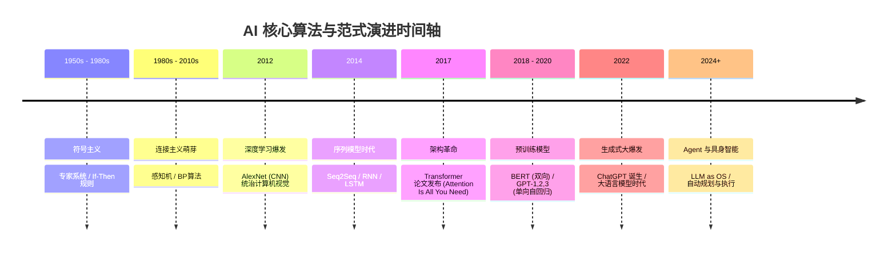

> 万物皆数，从规则的牢笼走向概率的自由。

在直接上手写 Agent 代码之前，我们必须先花点时间把底层的 AI 原理、算法逻辑和演进脉络彻底吃透。只有知其然更知其所以然，才能在后续的工程实践中游刃有余，避免成为只会调 API 的“API Caller”。

本篇是《AI 技术演进与核心算法实战：从原理到 Agent》系列的第一篇。我们将一起溯源 AI 的发展简史，理清技术演进脉络，理解 AI 到底是如何从刻板的规则走向智能的“思考”的。

## 1. 符号主义时代：基于规则的专家系统

早期的人工智能探索主要集中在**符号主义（Symbolism）**。这一流派认为，人类的认知可以被还原为对符号的逻辑运算。如果能把人类的知识抽象为一条条“规则”，机器就能像专家一样解决问题。

这就是**专家系统（Expert Systems）**的由来。它的核心逻辑非常简单粗暴：`If-Then`（如果-那么）。

```python
# 一个极简的“医疗诊断”专家系统
def diagnose(symptoms):
    if "发热" in symptoms and "咳嗽" in symptoms:
        if "呼吸困难" in symptoms:
            return "疑似肺炎，请立即就医！"
        else:
            return "可能是普通感冒或流感。"
    elif "头痛" in symptoms:
        return "可能是偏头痛或疲劳导致。"
    else:
        return "症状不明确，建议咨询真实医生。"
```

### 为什么符号主义最终走向了没落？

尽管专家系统在特定领域（如早期的医疗诊断、化学分析）取得了一些成功，但它遇到了一个无法逾越的瓶颈：**现实世界的模糊性**。

- **规则爆炸**：现实世界的变量太多了，你无法穷举所有的 `If-Then` 规则。
- **特征难以提取**：如何用语言描述一张猫的照片？“如果有两只尖耳朵、四条腿、有尾巴……”那如果是一只折耳猫呢？如果猫被遮挡了呢？
- **缺乏泛化能力**：遇到规则库中没有的情况，系统会直接崩溃。

符号主义的失败，让人们意识到：智能不能被简单地“编程”出来，必须让机器学会自己“学习”。

## 2. 连接主义崛起：神经网络与深度学习

当符号主义陷入低谷时，**连接主义（Connectionism）**迎来了春天。连接主义不再试图教机器具体的规则，而是模仿人类大脑的神经元结构，让机器通过大量数据自己寻找规律。

这就是**人工神经网络（Artificial Neural Networks, ANN）**的起点。

### 从感知机（Perceptron）到深度学习

感知机是最基础的神经网络单元。它接收多个输入，对其进行加权求和，然后通过一个激活函数决定是否“激活”。

随着算力的提升和数据的爆发，单层感知机进化成了拥有多个隐藏层的**深度神经网络（Deep Learning）**。

在这一时期，两大明星算法脱颖而出，彻底解决了感知问题：

1. **CNN（卷积神经网络）**：解决了图像识别问题。它通过局部感受野和权值共享，像人类的眼睛一样，逐层提取图像的边缘、纹理和高级特征。
2. **RNN（循环神经网络）与 LSTM**：解决了序列问题（如语音、文本）。它通过隐藏状态（Hidden State）将历史信息传递到当前时刻，使网络拥有了“记忆”。

连接主义的本质是**概率与拟合**。我们不再告诉机器什么是猫，而是给它看一百万张猫的照片，让它通过反向传播算法（Backpropagation）不断调整权重，最终拟合出一个能够以极高概率认出猫的数学模型。

## 3. 生成式革命：Transformer 架构的诞生

深度学习虽然强大，但 RNN 在处理长文本时存在严重的“遗忘”问题，且无法并行计算。直到 2017 年，Google 提出了一篇名为《Attention Is All You Need》的划时代论文，**Transformer** 架构横空出世，开启了 AI 的第三次范式转移。

### 为何“注意力机制”让机器理解了语言？

Transformer 抛弃了 RNN 的顺序处理机制，引入了**自注意力机制（Self-Attention）**。

自注意力机制的直觉非常简单：**当我们理解一句话时，句子里的每个词对我们理解当前词的贡献是不同的**。

举个例子：“苹果公司今年发布了新的苹果手机，我吃了一个苹果。”
在这句话中，第一个“苹果”和“公司”关联度极高，最后一个“苹果”和“吃”关联度极高。

Self-Attention 通过计算词与词之间的相似度得分，让模型在处理每一个词时，都能“看到”全局，并把注意力集中在相关的上下文上。这种机制不仅彻底解决了长距离依赖问题，还完美支持并行计算，使得模型可以无限做大（Scaling Law）。

## 4. 关键转折：从“判别式 AI”到“生成式 AI”

Transformer 的诞生，标志着 AI 技术发生了一个本质的跨越：**从判别式 AI 走向生成式 AI**。

- **判别式 AI（Discriminative AI）**：核心任务是分类或预测（分类猫和狗，预测房价）。它是在画一条边界线。
- **生成式 AI（Generative AI）**：核心任务是创造（写诗、写代码、生成图像）。它是基于学到的概率分布，不断预测下一个概率最高的 Token（Next Token Prediction）。

正是这种看似简单的“文字接龙”游戏（Next Token Prediction），当模型参数量和训练数据大到一定程度时，奇迹般地涌现出了**推理（Reasoning）**和**逻辑能力**，诞生了今天我们看到的 ChatGPT。

## 5. 三次范式转移的演进全景

为了更直观地理解这三次范式转移，我们可以看下面这张演进时间轴与对比图谱。

### AI 技术演进时间轴



### 三大范式对比

| 对比维度 | 符号主义时代 (专家系统) | 连接主义时代 (判别式 AI) | 生成式革命 (生成式 AI) |
| :--- | :--- | :--- | :--- |
| **核心逻辑** | 基于明确的逻辑规则推理 | 拟合数据分布，寻找特征边界 | 学习联合概率分布，生成新数据 |
| **代表算法** | 决策树、专家系统、知识图谱 | CNN、RNN、SVM、随机森林 | Transformer、Diffusion、GAN |
| **擅长领域** | 确定性逻辑、规则明确的任务 | 图像分类、语音识别、预测 | 文本生成、代码编写、多模态创造 |
| **主要瓶颈** | 无法处理模糊性，知识难以穷举 | 依赖大量标注数据，缺乏逻辑推理能力 | 幻觉问题，知识更新困难 |
| **数据需求** | 人类专家手工录入规则 | 大量人工标注数据 (Supervised) | 海量无标注数据自监督学习 (Self-Supervised) |
| **本质特征** | 演绎法 (Deduction) | 归纳法 (Induction) | 概率生成与涌现 (Emergence) |

## 结语：一切皆概率

回顾 AI 的发展史，我们可以清晰地看到一条主线：**人类放弃了教机器“规则”，转而教机器理解“概率”。**

从最早的 If-Then 牢笼，到神经网络的非线性拟合，再到 Transformer 暴力的概率预测，智能的火花在海量数据与算力的碰撞中逐渐绽放。

下一篇，我们将深入 LLM 的“黑盒”，拆解 Transformer 的内部结构，亲自用代码走一遍 Token 是如何经过 Self-Attention 变成有意义的回答的。敬请期待《解码大语言模型：Transformer 架构与 Token 预测原理》。

---

## 📚 参考文献与延伸阅读

1. **Attention Is All You Need** (Vaswani et al., 2017) - 提出了划时代的 Transformer 架构，Self-Attention 机制的起源，彻底改变了自然语言处理领域的格局。
2. **Deep Learning** (LeCun, Bengio, & Hinton, 2015, *Nature*) - 深度学习三大巨头合著的经典综述，全面总结了连接主义在图像识别和语音识别等感知领域的成功。
3. **Language Models are Few-Shot Learners** (Brown et al., 2020) - OpenAI 关于 GPT-3 的经典论文，展示了生成式 AI 随着规模扩大涌现出的惊人推理能力（In-Context Learning）。
4. **Learning representations by back-propagating errors** (Rumelhart, Hinton, & Williams, 1986) - 奠定多层神经网络反向传播算法（Backpropagation）基础的里程碑著作。
5. **Artificial Intelligence: A Modern Approach** (Stuart Russell & Peter Norvig) - 经典的 AI 教材，书中详细探讨了早期符号主义、专家系统以及逻辑推理的局限性。

---
> **下一篇预告：** [解码大语言模型：Transformer 架构与 Token 预测原理](#)
